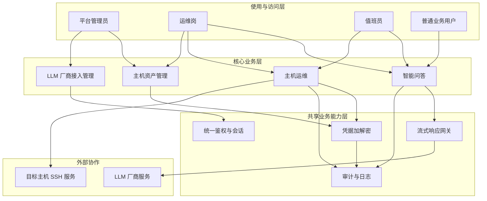

# AI 助手 产品概要说明书

> 版本：v1.0 · 状态：草稿 · 适用迭代：myDiyManager v3.8.8+
>
> 关联文档：本文档为产品概要级；三个核心交互页（AI 助手主页、主机抽屉、LLM 厂商管理）后续可单独出"菜单需求文档"。

---

## 一、概述

### 1.1 背景与现状

#### 业务场景

- **使用主体**：本系统全部在册用户，含平台管理员、运维岗、值班员与普通业务用户。
- **核心诉求**：在工作台里既能"问一句答一句"地获取业务知识（流程、规章、说明类问题），又能对所管辖主机发起自然语言驱动的运维巡检与信息查询，不再依赖 SSH 逐条手敲。
- **现有方案及局限**：当前所有运维动作均依赖人工——查文档要登知识库、问同事；查主机信息要 SSH 登录、敲命令、看输出；命令是否合规、是否越权全凭人盯。效率低、覆盖面窄、夜间无人值守时几乎停摆。

#### 现状的核心问题

1. **知识获取门槛高**：业务规则、流程说明散落在文档、聊天记录、口口相传里，新人/值班员找不到统一入口。
2. **主机巡检成本高**：每次巡检需 SSH 上多台机器逐条敲命令，结果还要人工整理，频次与覆盖面难以保证。
3. **运维动作缺乏可审计的人机协作边界**：AI 生成命令若直接执行，存在越权与误操作风险；完全人工执行又浪费 AI 的能力。
4. **大模型接入碎片化**：不同厂商（OpenAI、DeepSeek、月之暗面、智谱、自建 vLLM 等）接口形态各异，缺乏统一接入点。

#### 解决方案目标

建设一个集中式 AI 助手模块：以统一适配层对接任意兼容 OpenAI 协议的 LLM 服务，前端在一个页面内以"智能问答"+"主机运维"两个 Tab 承载通用知识问答与基于主机的运维操作，配套"主机抽屉"管理 SSH 凭据与目标主机，并对 AI 生成的运维命令实行"逐条 + 会话内 + 一律拒绝"三档人机协作边界。

### 1.2 产品目标

- **目标一**：在统一 AI 助手页接入 ≥ 1 家 OpenAI 兼容 LLM 厂商，支持管理员后续扩展更多厂商而不改动业务代码。
- **目标二**：智能问答 Tab 支持 SSE 流式输出，首 token 到达时延 P95 ≤ 3s，整段回答端到端连续无卡顿。
- **目标三**：主机运维 Tab 支持所辖全部主机的接入与并行操作，认证方式覆盖口令与私钥两种。
- **目标四**：AI 生成的每条运维命令必须经过三档按钮（允许 / 本次会话内允许 / 拒绝）的人为裁决，未裁决命令不得执行。
- **目标五**：所有命令执行、凭据使用、AI 对话必须留痕，可由审计岗回溯。

### 1.3 术语表

> 定义本文档中使用的关键术语，帮助读者对齐理解。

| 术语 | 含义 |
| :--- | :--- |
| LLM | 大语言模型，本模块对接 OpenAI 兼容协议的 Chat Completion 接口 |
| SSE | Server-Sent Events，服务端单向推送流式文本的协议 |
| OpenAI 兼容 | 遵循 OpenAI Chat Completions 接口规范（含流式、tool calling、temperature 等参数）的服务 |
| 主机 | 运维目标 Linux/类 Unix 服务器，含 IP、端口、协议、用户名、认证方式 |
| 会话 | 用户进入主机运维 Tab 到关闭 Tab/退出页面/超时 内的一段持续上下文，"本次会话内允许"的有效期 |
| 三档审批 | "允许（单次）"、"本次会话内允许（同类命令）"、"拒绝"三种人工裁决语义 |
| 厂商 | 提供 OpenAI 兼容 LLM 服务的供应商（如 OpenAI、DeepSeek、智谱、月之暗面、Ollama/vLLM 自建等） |
| 凭据 | 主机登录所需的密码或私钥，本模块统一加密落库 |
| 抽屉 | 页面右侧滑出的侧边面板，用于管理主机资产 |
| 高危命令 | 命中预设关键词清单（如 `rm -rf /`、`chmod 777`、`mkfs`、`shutdown` 等）的命令，需额外红色提示 |
| 同类命令 | 在"本次会话内允许"语境下，与已批准命令具有相同关键动词与目标对象的命令 |

---

## 二、角色与权限

### 2.1 角色定义

| 角色 | 职责描述 | 主要使用方式（业务入口） |
| :--- | :--- | :--- |
| 平台管理员 | 维护 LLM 厂商接入、模型选择、默认参数；管理全量主机 | LLM 厂商管理 + 主机抽屉 |
| 运维岗 | 日常巡检、故障排查、变更操作主机 | AI 助手主机运维 Tab + 主机抽屉（本部门主机） |
| 值班员 | 非工作时间应急处置主机 | AI 助手主机运维 Tab（受限于其主机权限范围） |
| 普通业务用户 | 提问规章制度、流程、说明类问题 | AI 助手智能问答 Tab |
| 审计岗 | 查阅 AI 对话、命令执行、凭据调用的全量记录 | 本系统审计模块（不在本 PRD 范围） |

### 2.2 权限矩阵

> 明确各角色可执行的操作，便于评审权限边界；页面级细矩阵可在各菜单需求文档中展开。

| 操作 | 平台管理员 | 运维岗 | 值班员 | 普通业务用户 |
| :--- | :--- | :--- | :--- | :--- |
| 接入 / 管理 LLM 厂商 | ✓ | - | - | - |
| 切换 / 调参 LLM 模型 | ✓ | - | - | - |
| 新增 / 编辑 / 删除主机 | ✓（全量） | ✓（仅本部门主机） | - | - |
| 智能问答 Tab 对话 | ✓ | ✓ | ✓ | ✓ |
| 主机运维 Tab 对话 | ✓ | ✓ | ✓（受主机范围限制） | - |
| 执行 AI 生成的命令 | ✓ | ✓ | ✓ | - |
| 审批命令（三档按钮） | ✓ | ✓ | ✓ | - |
| 查阅审计日志 | ✓（全量） | - | - | - |

> 备注：主机数据权限（按部门/区域）的细粒度规则，与本系统 RBAC 表对齐，本 PRD 不重复定义。

---

## 三、系统的整体架构与主流程

> 本章从**业务与能力**角度描述「系统由哪些部分构成、主链路如何闭环」，不描述前后端实现、接口与代码结构。

### 3.1 系统总体架构

> 节点均为业务域、能力群或使用主体名称。

**架构图：**

**架构说明：**

| 序号 | 图中位置 | 填写要求 |
| :--- | :--- | :--- |
| 1 | 使用与访问层 | 四类使用主体通过统一 Web 工作台访问 AI 助手页，按角色控制 Tab 可见性与主机数据范围 |
| 2 | 核心业务层 | 四大业务域——智能问答、主机运维、主机资产管理、LLM 厂商接入管理——分别对应页面 Tab 与抽屉；运维域强依赖资产管理域提供的目标主机清单与凭据 |
| 3 | 共享业务能力层 | 统一鉴权复用本系统 RBAC 与登录态；流式响应网关负责把任意 LLM 厂商的 SSE/分块流转换为前端统一增量渲染；凭据加解密服务集中管理主机口令与私钥；审计与日志服务集中记录对话与命令 |
| 4 | 外部协作层 | LLM 厂商服务（OpenAI/DeepSeek/智谱/月之暗面/vLLM 等兼容协议服务）；目标主机 SSH 服务（用户自有资产） |

### 3.2 系统级主流程（端到端）

主成功路径：

1. **【平台初始化】**：平台管理员在 LLM 厂商接入管理中完成至少 1 家厂商的接入（baseUrl、apiKey、模型名、默认参数）。
2. **【资源准备】**：运维岗在主机资产管理中录入目标主机（IP、端口、协议、用户名、认证方式、口令/私钥），凭据由系统加密落库。
3. **【发起提问·智能问答】**：用户进入智能问答 Tab，输入自然语言问题；系统经流式响应网关转给选定的 LLM 厂商，SSE 增量回写到聊天窗口。
4. **【发起提问·主机运维】**：运维岗/值班员进入主机运维 Tab，在聊天框上方多选目标主机，输入运维诉求（巡检、查询、变更等）。
5. **【命令生成】**：系统把"用户诉求 + 选中主机信息 + 系统预置 system prompt（含白名单、可执行命令风格）"提交给 LLM，LLM 流式返回自然语言答复 + 待执行命令。
6. **【人为裁决】**：每条 LLM 生成的命令下方展示"允许"、"本次会话内允许"、"拒绝"三档按钮，运维人员按业务合规判断点选。
7. **【命令执行】**：被允许的命令由本系统通过 SSH 在目标主机上执行（凭据由凭据服务临时解密到内存），结果回写到聊天窗口。
8. **【会话内允许】**：选择"本次会话内允许"的同类命令，在当前 Tab 会话期内不重复弹审，直接执行；会话结束（关闭 Tab、退出、超时）即失效。
9. **【审计归档】**：每条对话、每条命令的"原始诉求、LLM 答复、命令原文、用户裁决、执行结果、执行时间"全量落入审计与日志服务。
10. **【终态】**：用户关闭页面/超时，对话快照与执行结果归档至审计库；会话内允许的口令失效。

### 3.3 与外部协作的关系（业务级）

| 外部协作方 | 业务上依赖什么 | 本平台对外提供什么（业务结果） | 备注 |
| :--- | :--- | :--- | :--- |
| LLM 厂商服务 | 提供自然语言理解、命令生成、问答能力 | 本平台用户每一次发问的请求体与执行反馈 | apiKey 由本平台管理员保管；对话内容不外发至厂商以外的第三方 |
| 目标主机 SSH 服务 | 提供受管主机的 shell 执行能力与查询结果 | 通过本系统对主机的运维操作记录与变更影响 | 凭据不在厂商侧出现，认证与执行都在本系统内完成 |

---

## 四、菜单与需求文档索引

> 用下表维护**菜单**与**对应需求文档**的映射，便于评审与追溯。

| 菜单名称 | 说明 | 菜单目录 | 需求文档路径 |
| :--- | :--- | :--- | :--- |
| AI 助手 | 集成智能问答与主机运维的一体化页面，含主机抽屉、命令审批三档 | 工具 / AI 助手 | docs/current/modules/ai-assistant/PRD_AI助手.md（本文档） |
| 主机管理（抽屉入口） | 在 AI 助手页内右侧滑出，承载 SSH/私钥主机的增删改查 | 工具 / AI 助手（抽屉） | docs/current/modules/ai-assistant/PRD_AI助手.md（本文档） |
| LLM 厂商管理 | 维护兼容 OpenAI 协议的 LLM 厂商接入与默认参数（仅管理员可见） | 系统管理 / LLM 厂商 | docs/current/modules/ai-assistant/PRD_AI助手.md（本文档） |

> 注：本文档为产品概要级，三个菜单/抽屉的页面级字段、枚举、校验规则可后续单独出"菜单需求文档"。

---

## 五、非功能需求（NFR）

### 5.1 性能

| 指标 | 目标值 | 备注 |
| :--- | :--- | :--- |
| 智能问答 SSE 首 token 到达 | P95 ≤ 3s | 排除极端长 prompt 与公网抖动 |
| 智能问答整段回答端到端 | P95 ≤ 30s（1500 字以内） | 取决于厂商速率 |
| 主机运维命令单条执行反馈 | P95 ≤ 5s（不含命令自身耗时） | 不阻塞聊天 |
| 主机抽屉列表加载 | P95 ≤ 1.5s | ≤ 200 台规模 |
| LLM 厂商切换 / 校验联通 | P95 ≤ 5s | 主动 ping 厂商 healthcheck |
| 并发在线用户 | ≥ 50 个 AI 会话 | 单实例基线 |

### 5.2 可用性

| 检查项 | 目标 / 要求 |
| :--- | :--- |
| 核心功能可用性 | ≥ 99.5%（受 LLM 厂商可用性间接影响） |
| 厂商故障 | 当某厂商不可达时，提示用户切换厂商；正在进行的 SSE 允许平稳结束；不会因厂商超时影响本系统其他功能 |
| 主机 SSH 不可达 | 单条命令可配置超时（默认 30s）；超时即在聊天窗口回报"主机不可达"，不阻塞后续命令 |
| 降级方案 | LLM 厂商全挂时，主机抽屉与"主机管理"基础能力仍可用（脱离 AI 也可手动录入/查询） |

### 5.3 安全

| 检查项 | 要求 |
| :--- | :--- |
| 权限控制 | 复用本系统 RBAC；按"角色 + 部门/数据范围"控制主机可见与可执行性；AI 生成命令同样受权限约束 |
| 凭据安全 | 主机口令与私钥在数据库加密存储（密钥与本系统既有 Jasypt 主密钥管理一致）；仅在执行命令的瞬时于内存解密，使用完毕即清除 |
| 传输安全 | 浏览器 ↔ 本系统 https；本系统 ↔ LLM 厂商 https；本系统 ↔ 目标主机 SSH 协议（口令或私钥） |
| 审计追溯 | 必记录：提问内容、LLM 答复、命令原文、用户裁决（允许/会话内允许/拒绝 + 时间 + 用户）、执行结果（stdout/stderr/exitcode）、目标主机、操作时间 |
| 合规要求 | 对话内容不在前端页面持久化（默认仅保留当前会话）；归档数据按本系统既有日志保留策略 |
| 高危命令 | 涉及 `rm -rf /`、`chmod 777`、`dd`、`mkfs`、`shutdown/reboot`、`iptables -F`、`userdel`、`kill -9 1` 等命令的 LLM 答复须在聊天框下方额外红色提示"高危操作，请人工复核"；用户仍按三档按钮裁决 |

### 5.4 兼容性

| 检查项 | 要求 |
| :--- | :--- |
| 存量数据 / 配置 | 主机抽屉的"主机"实体与本系统既有 sys_* 体系独立建表；不破坏既有 RBAC、菜单、字典 |
| 厂商协议兼容 | 任意 OpenAI 兼容 Chat Completions（含 `/v1/chat/completions` 流式输出）接口；其它协议不在本期范围 |
| 客户端环境 | 与本系统既有前端一致（Chrome ≥ 90、Edge ≥ 90；EventSource 支持） |

### 5.5 可维护性

| 检查项 | 要求 |
| :--- | :--- |
| 日志 | 关键操作（厂商切换、主机增删改、命令执行、凭据调用）INFO 级 + traceId；LLM 原始请求 / 响应单独 PII 脱敏日志 |
| 监控告警 | LLM 厂商连通率、SSE 首 token 时延、SSH 命令失败率三项纳入监控；阈值越界告警 |
| 配置管理 | 厂商接入参数存数据库 + 系统配置表；变更走本系统既有 sys_config 流程，不落代码 |

### 5.6 可测试性

| 检查项 | 说明 |
| :--- | :--- |
| 测试环境要求 | 提供至少 1 个 mock LLM 厂商（本地 vLLM/Ollama + 兼容协议），便于无外网环境回归 |
| 测试难点 | 三档按钮的"会话内允许"边界（同类命令识别）需覆盖；高危命令红色提示的关键词维护需回归 |
| 测试数据 | 准备若干目标主机（容器化 SSH 服务 + 可观测的"巡检结果"） |

---

## 六、验收标准

> 汇总可独立验证的验收条款；可按菜单或能力域分类。细则可与各菜单需求文档中的 AC 互链。

### 6.1 功能验收

| 编号 | 所属模块 / 菜单 | 验收场景 | 前置条件 | 操作步骤 | 预期结果 |
| :--- | :--- | :--- | :--- | :--- | :--- |
| AC-01 | AI 助手 / 智能问答 | 流式问答 | 至少 1 个 LLM 厂商已接入 | 进入智能问答 Tab，输入问题 | 聊天窗口按 token 增量刷新；首 token ≤ 3s |
| AC-02 | AI 助手 / 智能问答 | 厂商切换 | ≥ 2 个 LLM 厂商已接入 | 切换默认厂商后再次提问 | 新问答走新厂商；不需刷新页面 |
| AC-03 | AI 助手 / 主机抽屉 | 新增口令主机 | 用户有主机管理权限 | 点击抽屉"新增" → 选"口令" → 填表 → 保存 | 列表新增一条；口令字段不回显明文 |
| AC-04 | AI 助手 / 主机抽屉 | 新增私钥主机 | 用户有主机管理权限 | 点击抽屉"新增" → 选"私钥" → 填表 → 保存 | 列表新增一条；私钥字段不回显明文 |
| AC-05 | AI 助手 / 主机抽屉 | 测试连通 | 主机已存在 | 点击主机行的"测试连接" | 反馈成功 / 失败 + 失败原因 |
| AC-06 | AI 助手 / 主机运维 | 多主机巡检 | 抽屉中已加 ≥ 2 台主机 | 在聊天框上方多选主机 → 提问"巡检磁盘" | LLM 返回自然语言 + 命令；命令下方展示三档按钮 |
| AC-07 | AI 助手 / 主机运维 | 命令·允许 | 已生成命令 | 点击"允许" | 命令被执行；结果回写到聊天窗口 |
| AC-08 | AI 助手 / 主机运维 | 命令·本次会话内允许 | 已生成同类命令 | 点击"本次会话内允许" | 该命令被执行；同一会话内同类命令自动通过不再弹审 |
| AC-09 | AI 助手 / 主机运维 | 命令·拒绝 | 已生成命令 | 点击"拒绝" | 命令不执行；聊天窗口追加"已拒绝"标记 |
| AC-10 | AI 助手 / 主机运维 | 会话边界 | 已选过"本次会话内允许" | 关闭 Tab 后重新进入 | 该"会话内允许"失效；同类命令重新弹审 |
| AC-11 | AI 助手 / 主机运维 | 主机范围隔离 | 用户仅有 A 部门主机权限 | 在抽屉列表中尝试访问 B 部门主机 | 抽屉不可见 B 部门主机；通过 URL 直接访问同样不可达 |
| AC-12 | AI 助手 / 主机运维 | 高危命令提示 | LLM 返回含 `rm -rf /` | 观察命令下方 | 出现红色高危提示；按钮照常可点 |

### 6.2 关联能力变更验收

| 编号 | 关联功能 | 验收场景 | 前置条件 | 操作步骤 | 预期结果 |
| :--- | :--- | :--- | :--- | :--- | :--- |
| AC-20 | 本系统 RBAC | 新增 AI 助手菜单 | 已有 admin / 普通角色 | 管理员为"运维岗"勾选"AI 助手:主机运维"权限 | 仅运维岗可见主机运维 Tab；普通用户仅可见智能问答 Tab |
| AC-21 | sys_menu 字典 | AI 助手入口 | 已有菜单挂载机制 | 部署 Flyway 迁移 | AI 助手菜单与子菜单出现在系统菜单中；按权限显示 |
| AC-22 | 审计模块 | AI 命令审计 | 审计岗有查阅权限 | 触发一条命令执行 → 切到审计模块 | 审计模块可按"用户 / 主机 / 时间"过滤到该条记录 |

### 6.3 非功能需求验收

| 编号 | 类别 | 验收场景 | 验收标准 | 测试方法 |
| :--- | :--- | :--- | :--- | :--- |
| AC-30 | 性能 | 50 并发 SSE 智能问答 | 首 token P95 ≤ 3s；平均帧间隔稳定 | 压测脚本模拟 50 并发用户连续问答 |
| AC-31 | 性能 | 100 台主机批量巡检 | 单条命令 P95 ≤ 5s（不含命令自身耗时） | 脚本对 100 台主机并发发起 `df -h` |
| AC-32 | 安全 | 凭据落库 | DB 中主机表口令/私钥字段为密文 | 直连 DB 抽查记录 |
| AC-33 | 安全 | 凭据内存 | 执行命令后内存中无明文驻留 | 命令执行结束 N 秒后对进程 dump 内存搜索关键字 |
| AC-34 | 安全 | 审计完整性 | 一条命令全链路留痕 | 触发命令 → 查审计模块 → 字段齐全 |
| AC-35 | 可用性 | 厂商不可达 | mock 厂商返回 503 | 页面提示"厂商不可用，请切换"；其他 Tab 不受影响 |
| AC-36 | 兼容 | 旧菜单不破坏 | 升级前已有菜单挂载 | 升级后旧菜单可见、可点击；无报错 |

---

## 七、外部依赖

| 依赖系统 / 服务 | 用途（业务视角） | 对接形态（可选） | 对接状态 |
| :--- | :--- | :--- | :--- |
| LLM 厂商服务（OpenAI / DeepSeek / 智谱 / 月之暗面 / 自建 vLLM 等） | 提供自然语言理解与命令生成 | OpenAI 兼容 Chat Completions（流式 + 非流式） | 待对接（按用户实际采购情况） |
| 目标主机 SSH 服务 | 受管主机的 shell 执行与查询 | SSH 2.0 协议（口令 / 私钥） | 既有复用（用户自有资产） |
| 本系统 RBAC | 角色 / 部门 / 主机范围控制 | 系统内模块调用 | 既有复用 |
| 本系统审计与日志 | AI 对话与命令执行留痕 | 系统内模块调用 | 既有复用 |
| 本系统配置中心 sys_config | LLM 厂商默认参数、命令白名单、高危命令关键词 | 系统内模块调用 | 既有复用 |

---

## 八、版本与变更记录

### 8.1 功能变化（本版本相对上一版本）

| 序号 | 变化类型 | 涉及菜单或业务功能 | 相对上一版本的变化说明 | 关联需求文档占位（可选） |
| :--- | :--- | :--- | :--- | :--- |
| 1 | 新增 | AI 助手 | 全新模块：智能问答 + 主机运维 + 主机抽屉 + LLM 厂商管理 | 本文档 |
| 2 | 新增 | 主机资产管理 | 抽屉内承载 SSH/私钥主机的增删改查与测试连接 | 本文档 |
| 3 | 新增 | LLM 厂商管理 | 平台管理员维护兼容 OpenAI 协议的 LLM 厂商接入 | 本文档 |
| 4 | 新增 | 命令三档审批 | "允许 / 本次会话内允许 / 拒绝" 的人机协作边界 | 本文档 |

---

## 九、附录

### 9.1 业务异常与提示口径

> 产品概要阶段列出**业务类别**；具体错误码与各接口说明放在菜单级需求文档或专项设计。

| 业务异常类别 | 典型触发场景 | 面向用户的提示原则 |
| :--- | :--- | :--- |
| LLM 厂商不可达 | 网络抖动、厂商 5xx、apiKey 失效 | 顶部条幅提示"当前厂商不可用，请切换或稍后重试"；不阻塞页面其他能力 |
| LLM 答复超时 | 长上下文或厂商响应慢 | 提示"答复较慢，可继续等待或取消"；用户可主动停止 SSE |
| 主机不可达 | 主机宕机、端口拒绝、SSH 协议不匹配 | 命令下方回报"主机 1.2.3.4:22 不可达，原因：xxx"；不影响其他主机 |
| 凭据错误 | 口令错、私钥错、用户无 sudo 权限 | 回报"认证失败"；不暴露明文凭据内容 |
| 命令执行超时 | 命令本身耗时 > 配置阈值 | 回报"命令执行超时（Ns），已终止"；不留下半截状态 |
| 三档按钮缺省 | 用户关闭弹窗或未点选即离开 | 默认按"拒绝"处理；不允许超时未裁决的命令自动执行 |
| 高危命令 | LLM 生成的命令命中关键词清单 | 红色提示"高危操作，请人工复核"；三档按钮仍可正常点选 |

### 9.2 审计事件清单

| 事件类型 | 触发时机 | 关键信息（业务字段口径） |
| :--- | :--- | :--- |
| AI_CONVERSATION_START | 用户进入任一 Tab 首次发问 | 用户、Tab 类型、会话 ID、时间 |
| AI_MESSAGE_SENT | 用户提交提问 | 用户、会话 ID、提问原文（截断）、目标主机列表（主机运维 Tab） |
| AI_MESSAGE_RECEIVED | LLM 厂商返回完毕 | 用户、会话 ID、答复原文（截断）、token 数、首 token 时延 |
| AI_CMD_PROPOSED | LLM 在主机运维 Tab 答复中给出命令 | 用户、会话 ID、命令原文、目标主机 |
| AI_CMD_ALLOW_ONCE | 用户点击"允许" | 用户、会话 ID、命令、目标主机、时间 |
| AI_CMD_ALLOW_SESSION | 用户点击"本次会话内允许" | 用户、会话 ID、命令摘要（用于同类识别）、目标主机、时间 |
| AI_CMD_REJECT | 用户点击"拒绝" | 用户、会话 ID、命令、目标主机、时间 |
| AI_CMD_EXECUTED | 命令在主机上执行完毕 | 用户、会话 ID、命令、目标主机、stdout/stderr 摘要、exitcode、耗时 |
| AI_CMD_TIMEOUT | 命令执行超时 | 用户、会话 ID、命令、目标主机、配置阈值 |
| HOST_ADD | 主机抽屉新增 | 操作人、主机名/IP/端口/协议/用户名/认证方式（不含凭证明文） |
| HOST_UPDATE | 主机抽屉修改 | 操作人、变更字段（不含凭证明文） |
| HOST_DELETE | 主机抽屉删除 | 操作人、主机标识 |
| HOST_TEST | 主机抽屉"测试连接" | 操作人、主机、结果 |
| LLM_VENDOR_ADD | 管理员新增厂商 | 管理员、厂商名、baseUrl、模型名（不含 apiKey） |
| LLM_VENDOR_UPDATE | 管理员修改厂商 | 管理员、变更字段（不含 apiKey） |
| LLM_VENDOR_DELETE | 管理员删除厂商 | 管理员、厂商名 |
| LLM_VENDOR_SWITCH | 管理员 / 系统切换默认厂商 | 切换人、原厂商、新厂商 |
