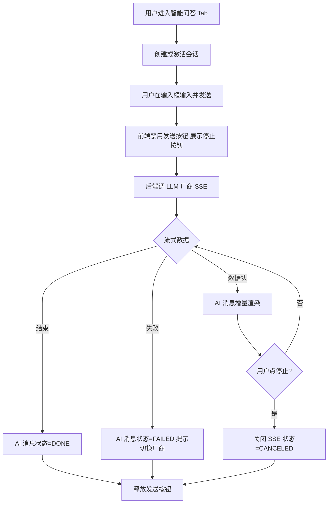
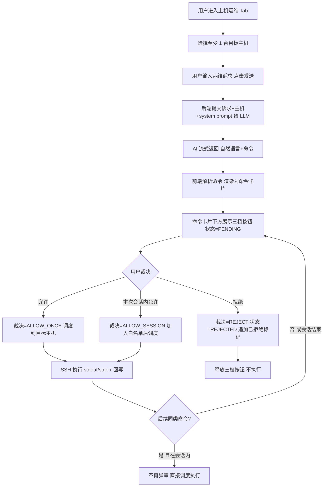
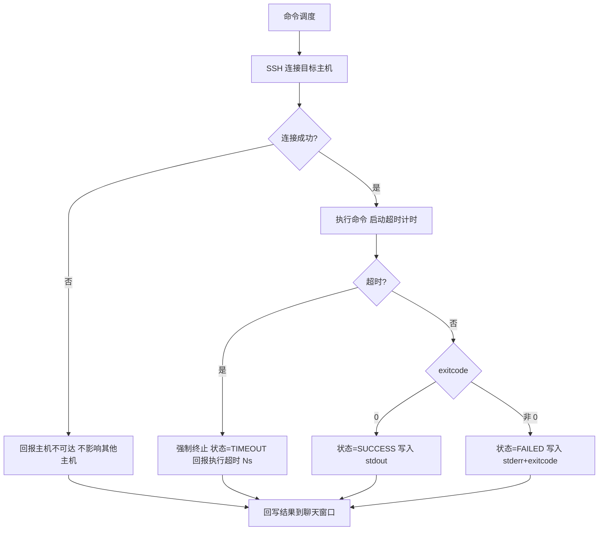

# AI 助手主页 需求文档

## 〇、文档信息

| 项目 | 内容 |
|------|------|
| 文档名称 | AI 助手主页 |
| 文档版本 | v1.0 |
| 状态 | 未确认 |
| 确认日期 | （未定稿） |
| 存放路径 | docs/current/modules/ai-assistant/PRD_AI助手主页.md |

## 功能概述

本页面集成"智能问答"与"主机运维"两类 AI 交互：智能问答 Tab 面向全体用户提供自然语言知识问答；主机运维 Tab 面向运维岗/值班员，叠加目标主机选择与命令三档审批，使 AI 能在授权边界内对真实主机执行查询与运维。同一页面顶部右上方常驻"主机抽屉"入口，跨 Tab 共享。

## 角色权限

| 维度 | 要求 |
|---|---|
| 数据权限 | 主机运维 Tab 中的目标主机清单按本系统 RBAC 数据范围过滤（运维岗仅本部门，管理员全量）；智能问答 Tab 无数据范围限制 |
| 功能权限 | 见下表 |

| 操作 | 平台管理员 | 运维岗 | 值班员 | 普通业务用户 |
|---|---|---|---|---|
| 进入 AI 助手主页 | ✓ | ✓ | ✓ | ✓ |
| 切换/查看智能问答 Tab | ✓ | ✓ | ✓ | ✓ |
| 切换/查看主机运维 Tab | ✓ | ✓ | ✓ | - |
| 切换当前 LLM 厂商 | ✓ | -（跟随默认） | - | - |
| 主机多选 | ✓ | ✓（本部门） | ✓（权限范围内） | - |
| 点击"允许"/"本次会话内允许" | ✓ | ✓ | ✓ | - |
| 点击"拒绝" | ✓ | ✓ | ✓ | - |
| 清空当前会话 | ✓ | ✓ | ✓ | ✓ |
| 新建会话 | ✓ | ✓ | ✓ | ✓ |

**权限字符串清单**（用于 `@PreAuthorize("@ss.hasPermi('...')")`）：

| 权限字符串 | 含义 | 对应操作 |
|---|---|---|
| `ai:chat:send` | 发送消息（智能问答 + 主机运维 Tab 通用入口） | 进入 AI 助手主页、两个 Tab 发送消息 |
| `ai:chat:cancel` | 取消生成 | AI 消息流式生成中点"停止" |
| `ai:chat:list` | 会话管理 | 新建/切换/清空会话 |
| `ai:chat:cmd` | 命令审批（三档按钮） | 点击"允许" / "本次会话内允许" / "拒绝" |

> Tab 可见性的菜单级权限通过 `sys_menu` 树挂载控制（详见《产品概要说明书》第四章与设计 spec §7.7）。

## 页面结构

主页面整体布局：

```text
┌────────────────────────────────────────────────────┐
│ 顶部栏  面包屑 / 标题 / 抽屉入口 / 用户菜单         │
├────────────────────────────────────────────────────┤
│ Tab 切换  [智能问答] [主机运维]                    │
├────────────────────────────────────────────────────┤
│ Tab 内容区（见下方）                               │
└────────────────────────────────────────────────────┘
```

Tab 1 智能问答：

```text
┌────────┬───────────────────────────────────────────┐
│ 左侧栏 │  厂商选择  [DeepSeek (默认) ▼]  ● 可用     │
│ 会话列 │───────────────────────────────────────────│
│ 表     │                                            │
│        │  消息列表（时间倒序向上）                  │
│ [+ 新建│  [系统] 欢迎使用 AI 助手…                  │
│  会话]  │  [用户] 请介绍今晚的巡检要点              │
│        │  [AI  ] ·····  [流式渲染]                  │
│ 会话1 ●│                                            │
│ 会话2  │                                            │
│ 会话3  │                                            │
│ ...    │                                            │
│        ├──────────────────────────────────────────┤
│        │  输入区  [多行文本框]   [发送] [清空]      │
└────────┴───────────────────────────────────────────┘
```

> 智能问答 Tab **不涉及主机**：无目标主机多选、无命令卡片、无主机管理抽屉入口；纯对话交互。主机相关能力由 Tab 2 承载。
> 左侧 260px 会话列表 + 右侧对话区，两个 Tab 共享同一份会话清单（点击切换）。

Tab 2 主机运维：

```text
┌────────────────────────────────────────────────────┐
│ 主机选择  [多选下拉]  当前：3 台     [主机抽屉入口]│
├────────────────────────────────────────────────────┤
│ 厂商选择  [厂商下拉]  当前：DeepSeek              │
├────────────────────────────────────────────────────┤
│ 会话切换  [+ 新建会话] [会话1] [会话2]             │
├────────────────────────────────────────────────────┤
│ 消息列表                                            │
│  [用户] 巡检磁盘                                    │
│  [AI  ] 建议执行：df -h                            │
│  ┌──────────────────────────────────────────┐      │
│  │  命令: df -h                              │      │
│  │  目标: host1 / host2 / host3             │      │
│  │  [允许] [本次会话内允许] [拒绝]           │      │
│  └──────────────────────────────────────────┘      │
│  [系统] 已允许。host1 输出：…                       │
├────────────────────────────────────────────────────┤
│ 输入区  [多行文本框]    [发送] [清空]              │
└────────────────────────────────────────────────────┘
```

> 抽屉入口触发右侧滑出"主机管理抽屉"，详见《主机管理抽屉》需求文档。LLM 厂商列表与默认参数的配置详见《LLM 厂商管理》需求文档。

## 枚举

#### 枚举：Tab 类型

| 存储值 | 展示名 | 说明 |
|---|---|---|
| CHAT | 智能问答 | 通用知识问答 |
| OPS | 主机运维 | 主机运维命令生成与执行 |

#### 枚举：消息角色

| 存储值 | 展示名 | 说明 |
|---|---|---|
| USER | 用户 | 用户发送 |
| AI | AI | LLM 答复 |
| SYSTEM | 系统 | 系统提示 / 拒绝标记 / 执行结果汇总 |

#### 枚举：消息状态

| 存储值 | 展示名 | 说明 |
|---|---|---|
| STREAMING | 生成中 | LLM 正在流式输出 |
| DONE | 已完成 | 流式结束 |
| FAILED | 失败 | 厂商不可达 / 超时 / 异常 |
| CANCELED | 已取消 | 用户主动停止 |

#### 枚举：命令裁决

| 存储值 | 展示名 | 说明 |
|---|---|---|
| PENDING | 待裁决 | 三档按钮未点选前 |
| ALLOW_ONCE | 允许 | 单次放行 |
| ALLOW_SESSION | 本次会话内允许 | 同类命令在当前会话内不再弹审 |
| REJECT | 拒绝 | 不执行 |

#### 枚举：命令执行状态

| 存储值 | 展示名 | 说明 |
|---|---|---|
| QUEUED | 待执行 | 已裁决通过，待调度到目标主机 |
| RUNNING | 执行中 | 至少一台主机尚在执行 |
| SUCCESS | 成功 | 全部目标主机 exitcode = 0 |
| PARTIAL | 部分成功 | 至少一台成功，至少一台失败 |
| FAILED | 失败 | 全部目标主机失败 |
| TIMEOUT | 超时 | 超过命令执行阈值 |
| REJECTED | 已拒绝 | 用户拒绝，未执行 |

## 目录树

不适用。本页无左侧目录树。

## 查询功能

不适用。本页为对话式交互，无独立查询区。历史会话通过"会话切换"按钮组承载（见页面结构图）。

## 列表展示

#### 列表：消息

| 字段名 | 类型 | 是否必填 | 默认值 | 是否唯一值 | 数据来源 | 说明 |
|---|---|---|---|---|---|---|
| 消息 ID | 字符串 | 是 | — | 是 | 系统生成 | 对应数据键：messageId |
| 会话 ID | 字符串 | 是 | — | 否 | 系统生成 | 同会话内不重复 |
| 消息角色 | 枚举 | 是 | — | 否 | 用户 / 系统写入 | 取值见「消息角色」枚举 |
| 消息内容 | 长文本 | 是 | — | 否 | 用户输入或 LLM 输出 | 长度 1~8000 字 |
| 状态 | 枚举 | 是 | DONE | 否 | 系统写入 | 取值见「消息状态」枚举 |
| 厂商标识 | 字符串 | 否 | — | 否 | 厂商管理读取 | 仅 AI 消息有值 |
| 首 token 时延毫秒 | 数值 | 否 | — | 否 | 系统统计 | 仅 AI 消息有值 |
| 创建时间 | 日期时间 | 是 | — | 否 | 系统生成 | 毫秒级 |

#### 列表：命令

| 字段名 | 类型 | 是否必填 | 默认值 | 是否唯一值 | 数据来源 | 说明 |
|---|---|---|---|---|---|---|
| 命令 ID | 字符串 | 是 | — | 是 | 系统生成 | 对应数据键：cmdId |
| 所属消息 ID | 字符串 | 是 | — | 否 | 关联 | 一条 AI 消息可挂 0~N 条命令 |
| 命令原文 | 字符串 | 是 | — | 否 | LLM 输出 | 长度 ≤ 2000 字 |
| 目标主机 ID 列表 | 字符串集合 | 是 | — | 否 | 用户多选 | 引用主机管理的主机 ID |
| 用户裁决 | 枚举 | 是 | PENDING | 否 | 用户点选 | 取值见「命令裁决」枚举 |
| 裁决用户 | 字符串 | 否 | — | 否 | 系统写入 | 裁决时填入 |
| 裁决时间 | 日期时间 | 否 | — | 否 | 系统写入 | 裁决时填入 |
| 命令摘要指纹 | 字符串 | 否 | — | 否 | 系统生成 | 用于"本次会话内允许"的同类识别；由"命令前缀 + 关键动词 + 目标对象类型"三要素构成 |
| 执行状态 | 枚举 | 是 | QUEUED | 否 | 系统写入 | 取值见「命令执行状态」枚举 |
| 执行结果摘要 | 长文本 | 否 | — | 否 | 系统写入 | stdout / stderr 截断汇总 |
| 执行耗时毫秒 | 数值 | 否 | — | 否 | 系统统计 | 多主机取最大值 |

## 列表卡片

不适用。本页无卡片 / 列表切换视图。

## 工具栏按钮

| 按钮名称 | 主/次 | 显隐条件 | 打开方式/行为 | 操作结果 |
|---|---|---|---|---|
| 新建会话 | 次 | 全角色可见 | 顶部"会话切换"行点击 + 按钮 | 新建空白会话；AI 消息为空；输入框获焦 |
| 切换会话 | 次 | 全角色可见 | 顶部"会话切换"行点击会话标签 | 切换当前活动会话；消息列表重渲染 |
| 删除会话 | 次 | 仅本人会话 | 鼠标悬停会话标签出现 ✕ 按钮 | 弹确认对话框 → 确认后从浏览器内存移除；审计仍保留 |
| 清空输入 | 次 | 输入框有内容时 | 输入区"清空"按钮 | 清空输入框；不影响已发消息 |
| 停止生成 | 主 | AI 消息处于 STREAMING 时 | 消息下方"停止"按钮 | 关闭 SSE；该消息状态置为 CANCELED |
| 重新生成 | 次 | AI 消息处于 DONE / FAILED / CANCELED 时 | 消息右下"重试"按钮 | 以最近一条用户消息为输入再次提交 |
| 复制消息 | 次 | 任意消息 | 消息右上"复制"按钮 | 复制消息文本到剪贴板；toast「已复制」 |
| 抽屉入口 | 主 | 全角色可见 | 顶部右上方"主机管理"按钮 | 右侧滑出主机管理抽屉 |
| 厂商切换 | 主 | 仅平台管理员 | 顶部"厂商选择"下拉 | 切换后所有新提问走新厂商；不刷新页面 |

#### 命令三档按钮（命令卡片内联）

| 按钮名称 | 主/次 | 显隐条件 | 打开方式/行为 | 操作结果 |
|---|---|---|---|---|
| 允许 | 主 | 用户裁决为 PENDING 时 | 点击命令卡片"允许"按钮 | 裁决 = ALLOW_ONCE；调度到目标主机执行；执行完成回写结果 |
| 本次会话内允许 | 主 | 用户裁决为 PENDING 时 | 点击命令卡片"本次会话内允许"按钮 | 裁决 = ALLOW_SESSION；调度到目标主机执行；该命令的"命令摘要指纹"加入当前会话白名单 |
| 拒绝 | 次 | 用户裁决为 PENDING 时 | 点击命令卡片"拒绝"按钮 | 裁决 = REJECT；状态 = REJECTED；不执行；聊天窗口追加"已拒绝"标记 |

## 表单设计

不适用。本页为对话式交互，无独立新增 / 编辑表单。
例外：消息输入框（多行文本框），字段见下。

#### 输入框字段表

| 字段名 | 类型 | 是否必填 | 默认值 | 是否唯一值 | 数据来源 | 说明 |
|---|---|---|---|---|---|---|
| 输入内容 | 长文本 | 是 | — | 否 | 用户输入 | 长度 1~4000 字；不可为空；发送后清空 |
| 当前 Tab | 枚举 | 是 | — | 否 | 系统读取 | 取值见「Tab 类型」枚举；与消息绑定 |
| 选中主机 ID 列表 | 字符串集合 | 智能问答：否；主机运维：是 | — | 否 | 顶部多选 | 主机运维 Tab 必填，空时"发送"按钮置灰 |
| 厂商标识 | 字符串 | 是 | 默认厂商 | 否 | 厂商管理读取 | 管理员可改；其他角色跟随默认 |

## 流程图

#### 流程 1：智能问答（流式问答）



**编号步骤：**

1. 用户进入智能问答 Tab；若无活动会话则自动创建一条。
2. 用户在输入框输入文本，点击「发送」或按 Ctrl+Enter。
3. 前端校验非空后禁用发送按钮，新增 AI 消息占位（状态 = STREAMING），消息卡片下显示「停止」按钮。
4. 后端按选定的 LLM 厂商发起流式请求；后端到前端的链路采用 SSE 或分块传输。
5. 每收到一个数据块，前端把增量文本追加到 AI 消息尾部，无需重新渲染整段。
6. 收到结束帧：消息状态置为 DONE；释放发送按钮；「停止」按钮消失。
7. 收到失败帧：消息状态置为 FAILED，提示「当前厂商不可用，请切换」；释放发送按钮。
8. 用户在生成中点击「停止」：前端关闭连接；消息状态置为 CANCELED；释放发送按钮。

#### 流程 2：主机运维（命令三档审批）



**编号步骤：**

1. 用户进入主机运维 Tab，在顶部多选至少 1 台目标主机；空时"发送"按钮置灰。
2. 用户输入运维诉求并点击「发送」。
3. 后端把"用户诉求 + 选中主机清单 + 预置 system prompt（白名单、可执行命令风格）"提交给 LLM，AI 消息开始流式返回。
4. 前端解析 AI 答复中的命令片段（按预定义结构化标记），每条命令独立渲染为命令卡片，状态 = QUEUED。
5. 命令卡片下方展示三档按钮（允许 / 本次会话内允许 / 拒绝），命令状态 = PENDING。
6. 用户点击"允许"：裁决 = ALLOW_ONCE，调度到目标主机执行。
7. 用户点击"本次会话内允许"：裁决 = ALLOW_SESSION，调度执行；该命令的"命令摘要指纹"加入当前会话白名单。
8. 用户点击"拒绝"：裁决 = REJECT，状态 = REJECTED，聊天窗口追加"已拒绝"标记，不执行。
9. 调度执行：后端通过 SSH 在每台目标主机上执行命令；执行结果按主机分别回写到聊天窗口（系统消息）。
10. 同类命令判断：若新命令的"摘要指纹"命中当前会话白名单，且会话未结束，则不再弹审，按 ALLOW_ONCE 流程直接调度执行。
11. 会话边界：关闭 Tab / 退出页面 / 超时（默认 30 分钟无活动），白名单清空。

#### 流程 3：命令超时与失败



**编号步骤：**

1. 调度执行时尝试 SSH 连接目标主机。
2. 连接失败：回报"主机 IP:PORT 不可达，原因：xxx"；不影响其他主机。
3. 连接成功：执行命令，启动默认 30s 超时计时。
4. 超时：强制终止命令，状态 = TIMEOUT，回报"命令执行超时（30s），已终止"。
5. 正常完成：exitcode = 0 则状态 = SUCCESS；非 0 则状态 = FAILED；分别写入 stdout / stderr 摘要。

## 导入导出

不适用。本页无导入 / 导出能力。

## 数据验证规则

### 校验范围与场景

校验触发场景为：用户在两个 Tab 内提交消息文本、选择主机、点选三档按钮。后端在以下入口做硬校验，前端做即时反馈。

### 正则形态校验（按字段）

##### 输入内容（`content`）

1. **适用场景**：智能问答 Tab 发送、主机运维 Tab 发送。
2. **正则表达式**：

```regex
^\s*(?:[\s\S]*\S[\s\S]*)?\s$
```

3. **匹配说明**：去除首尾空白后，内部至少含一个非空白字符；总长度 1~4000 字符。
4. **错误提示**：输入内容不能为空；输入内容长度不能超过 4000 字。

##### 主机名（`hostName`，从抽屉传入）

1. **适用场景**：主机运维 Tab 选中的主机入参做白名单校验。
2. **正则表达式**：

```regex
^[A-Za-z0-9_\-一-龥]{1,64}$
```

3. **错误提示**：主机名称包含非法字符或超过 64 字符。

> 其它主机字段（IP、端口、协议、用户名、认证方式）的正则校验放在《主机管理抽屉》需求文档的"数据验证规则"节内统一维护。

### 其它验证规则（非正则）

1. **消息非空**：智能问答与主机运维 Tab 发送时，输入内容去除空白后不可为空。
2. **消息长度上限**：输入内容 ≤ 4000 字；超出时按钮置灰并在输入框下方提示"最多 4000 字"。
3. **主机运维 Tab 主机必选**：主机运维 Tab 发送时，目标主机 ID 列表长度 ≥ 1；为 0 时"发送"按钮置灰并在主机选择行提示"请至少选择 1 台主机"。
4. **三档按钮互斥**：一条命令的裁决仅可被点选一次；点选后三个按钮整体置灰。
5. **同类命令识别**：本次会话内允许的"同类"由"命令前缀 + 关键动词 + 目标对象类型"三要素指纹决定；与裁决时填入"命令摘要指纹"字段。指纹算法留到设计阶段定义，本节仅约定行为。
6. **会话边界**：关闭 Tab / 退出页面 / 30 分钟无活动时，会话内允许白名单清空；新会话开启视为全新白名单。
7. **高危命令提示**：若命令命中关键词清单（`rm -rf /`、`chmod 777`、`dd of=/dev/`、`mkfs`、`shutdown`、`reboot`、`iptables -F`、`userdel`、`kill -9 1`），命令卡片顶部展示红色"高危操作，请人工复核"提示；三档按钮仍可点选。
8. **命令执行超时**：单条命令执行默认 30s 超时；可由管理员在「系统配置」中调整。
9. **厂商不可达**：调 LLM 厂商时若连续 2 次失败，提示"当前厂商不可用，请切换"；其它 Tab 不受影响。
10. **未裁决命令不执行**：命令状态 = PENDING 时（即用户未点选三档按钮），即便 AI 答复已结束，也不得调度到主机执行；会话期结束仍未裁决的命令按"拒绝"处理。

### 跨字段与业务规则

1. **角色 × 主机范围联动**：主机运维 Tab 多选下拉中的可选主机严格按用户数据范围过滤；越权的主机 ID 在后端校验时直接拒绝，并返回 403。
2. **管理员可见全量厂商**：LLM 厂商下拉仅平台管理员可改；其他角色跟随当前默认厂商。
3. **审计联动**：每条用户消息、AI 消息、命令三档裁决、命令执行结果均落入审计与日志服务（事件清单见《AI 助手 产品概要说明书》9.2 节）。

### 规则汇总（验收清单）

- [ ] AC-V01：智能问答与主机运维 Tab 的输入内容去除首尾空白后必含非空白字符。
- [ ] AC-V02：输入内容长度 ≤ 4000 字；超出禁止发送。
- [ ] AC-V03：主机运维 Tab 必选至少 1 台主机；未选时发送按钮置灰。
- [ ] AC-V04：一条命令仅可被裁决一次；裁决后三档按钮整体置灰。
- [ ] AC-V05：本次会话内允许的同类命令在会话期内不再弹审；关闭 Tab / 退出 / 30 分钟无活动后失效。
- [ ] AC-V06：高危命令必须额外红色提示，但不强制拦截。
- [ ] AC-V07：单条命令执行默认 30s 超时；超时即终止并回报。
- [ ] AC-V08：未裁决命令不得执行；会话结束仍未裁决按"拒绝"处理。
- [ ] AC-V09：厂商不可达需提示；其它 Tab 不受影响。
- [ ] AC-V10：用户提交主机 ID 不在自身数据范围内时，后端拒绝并返回 403。

## 注意事项

1. **同类命令识别的边界**：本节仅定义行为，具体的指纹算法（命令前缀 + 关键动词 + 目标对象类型）留到详细设计阶段定义，避免在需求文档层过早锁实现。
2. **三档按钮的"用户角色"边界**：值班员的审批权限受其数据范围限制；越权主机的命令虽能生成但执行会被后端拒绝，聊天窗口回报"无权限执行"。
3. **流式断流的兜底**：若 SSE 中途中断（网络抖动 / 服务重启），前端应在 10s 内将消息状态置为 FAILED 并提示用户"答复中断，可重试"；后端需在 60s 内主动发结束帧避免长连接悬挂。
4. **消息历史持久化**：本期对话历史仅保留在浏览器内存（关闭 Tab / 退出页面即清除）；如需跨会话保留，需在后续版本中扩展"会话存档"能力。
5. **抽屉与 Tab 的共享**：主机管理抽屉在两个 Tab 间共享同一份主机数据；同一时刻只能打开一个抽屉；关闭抽屉不影响当前 Tab 状态。
6. **厂商切换的可见性**：仅平台管理员可看到并修改"厂商选择"下拉；其他角色看到的是只读展示（跟随默认厂商）。
7. **多主机并发执行**：一条命令对多台主机的执行可并发调度；任一台超时不影响其它主机的执行；最终按"全部成功 / 部分成功 / 全部失败"汇总状态。
