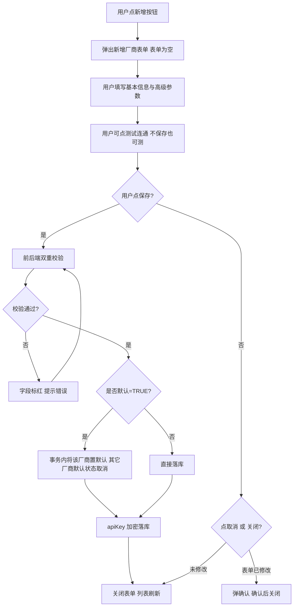
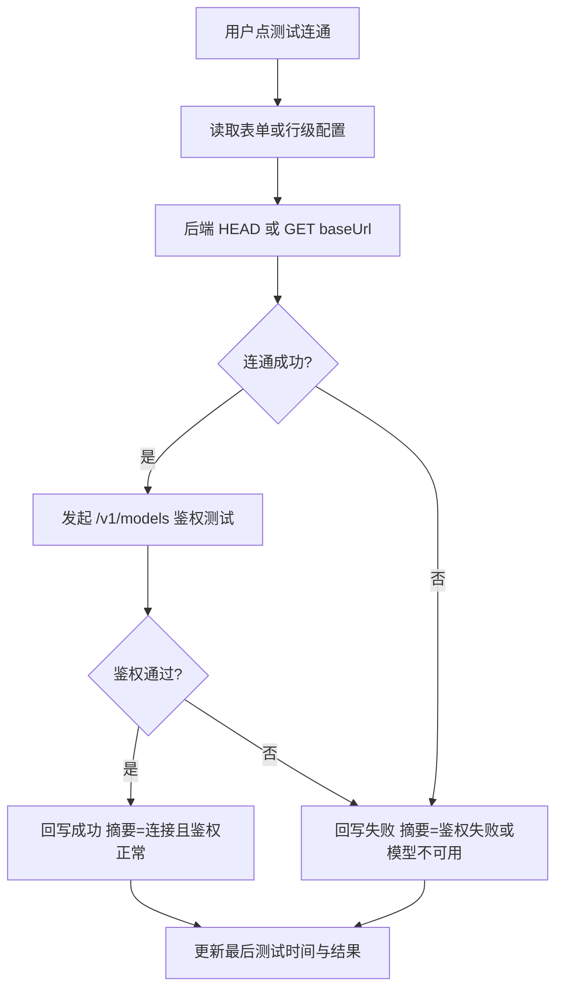
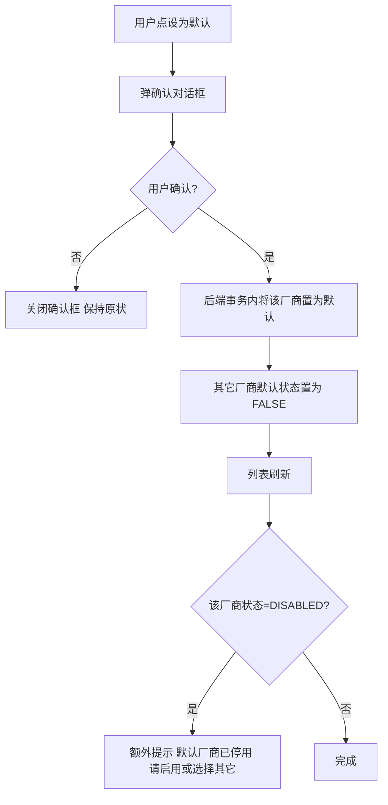
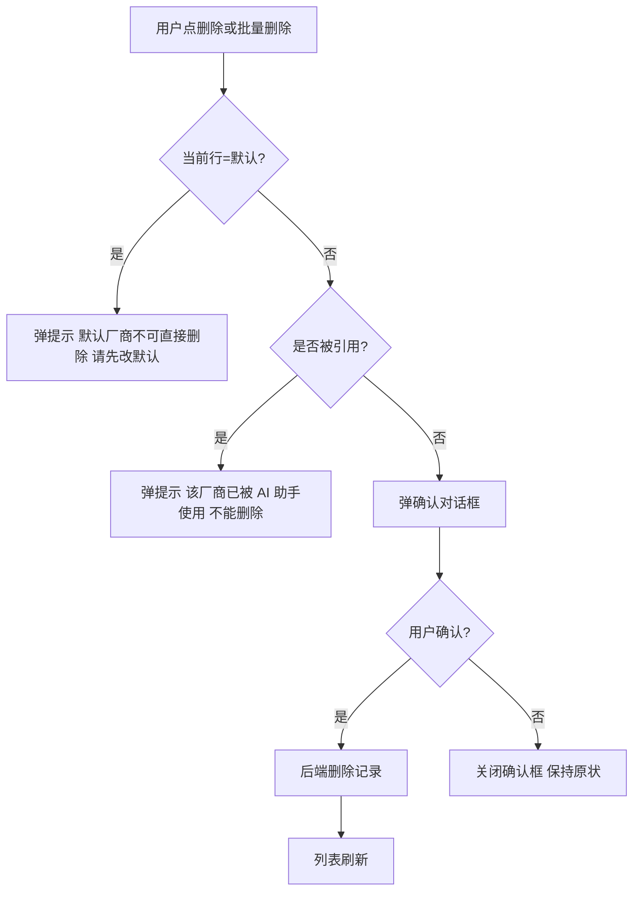

# LLM 厂商管理 需求文档

## 〇、文档信息

| 项目 | 内容 |
|------|------|
| 文档名称 | LLM 厂商管理 |
| 文档版本 | v1.0 |
| 状态 | 未确认 |
| 确认日期 | （未定稿） |
| 存放路径 | docs/current/modules/ai-assistant/PRD_LLM厂商管理.md |

## 功能概述

本页面用于维护"AI 助手"所对接的 LLM 厂商配置：支持录入多家兼容 OpenAI Chat Completions 协议的厂商（OpenAI、DeepSeek、智谱、月之暗面、自建 vLLM 等），维护每家厂商的 baseUrl、apiKey、模型名、默认参数、是否默认；提供测试连通、设为默认、编辑、删除等能力。AI 助手主页的"厂商选择"下拉数据来源于本页面。

## 角色权限

| 维度 | 要求 |
|---|---|
| 数据权限 | 仅平台管理员可访问本页面；其他角色入口不可见 |
| 功能权限 | 见下表 |

| 操作 | 平台管理员 | 运维岗 | 值班员 | 普通业务用户 |
|---|---|---|---|---|
| 进入 LLM 厂商管理 | ✓ | - | - | - |
| 查询厂商列表 | ✓ | - | - | - |
| 新增厂商 | ✓ | - | - | - |
| 编辑厂商 | ✓ | - | - | - |
| 删除厂商 | ✓ | - | - | - |
| 测试连通 | ✓ | - | - | - |
| 设为默认 | ✓ | - | - | - |
| 批量删除 | ✓ | - | - | - |

**权限字符串清单**（用于 `@PreAuthorize("@ss.hasPermi('...')")`）：

| 权限字符串 | 含义 | 对应操作 |
|---|---|---|
| `ai:vendor:list` | 厂商列表查询 | 列表加载、查询表单 |
| `ai:vendor:query` | 厂商详情 | 厂商行级"编辑"前置查详情 |
| `ai:vendor:add` | 新增厂商 | 工具栏"+ 新增"按钮 |
| `ai:vendor:edit` | 编辑厂商 | 厂商行级"编辑"按钮 |
| `ai:vendor:remove` | 删除厂商 | 厂商行级"删除" / 工具栏"批量删除" |
| `ai:vendor:test` | 测试连通 | 厂商行级"测试连通" / 表单内"测试连通" |
| `ai:vendor:default` | 设为默认 | 厂商行级"设为默认"按钮 |

> 页面入口本身已限定为"仅平台管理员"（sys_menu 树挂载控制），`ai:vendor:list` 在此基础上进一步控制查询按钮与列表数据。

## 页面结构

主区布局：

```text
┌────────────────────────────────────────────────────┐
│ 标题：LLM 厂商管理                                 │
├────────────────────────────────────────────────────┤
│ 查询区  [厂商名称] [状态] [查询] [重置]            │
├────────────────────────────────────────────────────┤
│ 工具栏  [+ 新增] [刷新] [批量删除]                 │
├────────────────────────────────────────────────────┤
│ 列表                                                │
│ ┌──────────────────────────────────────────────┐  │
│ │ □ 厂商 / baseUrl / 模型 / 状态 / 是否默认    │  │
│ │   ...                                        │  │
│ │ [编辑] [测试连通] [设为默认] [删除]          │  │
│ └──────────────────────────────────────────────┘  │
├────────────────────────────────────────────────────┤
│ 分页器                                             │
└────────────────────────────────────────────────────┘
```

新增 / 编辑厂商表单（弹层）：

```text
┌────────────────────────────────────────────────────┐
│ 标题：新增厂商 / 编辑厂商                  [× 关闭]│
├────────────────────────────────────────────────────┤
│ 基本信息                                            │
│  厂商名称 *                                         │
│  baseUrl *                                          │
│  apiKey *  （新增必填，编辑留空不修改）             │
│  模型名 *                                           │
│  状态 *  （启用 / 停用）                            │
│  是否默认 *                                         │
├────────────────────────────────────────────────────┤
│ 高级参数（可使用默认值）                            │
│  超时秒数     （默认 60）                           │
│  最大 token  （默认 2048）                          │
│  温度         （默认 0.7）                          │
├────────────────────────────────────────────────────┤
│ 备注                                                │
├────────────────────────────────────────────────────┤
│ 主操作区  [取消]   [测试连通]   [保存]              │
└────────────────────────────────────────────────────┘
```

> 表单打开方式：列表"+ 新增"或行级"编辑"按钮触发表单弹层；"测试连通"可在表单内就地测，不保存也可测。

## 枚举

#### 枚举：厂商状态

| 存储值 | 展示名 | 说明 |
|---|---|---|
| ENABLED | 启用 | 可被 AI 助手选用 |
| DISABLED | 停用 | 保留配置但 AI 助手不可见、不可选用 |

#### 枚举：是否默认

| 存储值 | 展示名 | 说明 |
|---|---|---|
| TRUE | 是 | AI 助手主页"厂商选择"下拉默认值；全表唯一 |
| FALSE | 否 | 非默认厂商 |

## 目录树

不适用。本页无左侧目录树。

## 查询功能

| 字段名 | 类型 | 是否必填 | 默认值 | 是否唯一值 | 数据来源 | 说明 |
|---|---|---|---|---|---|---|
| 厂商名称 | 字符串 | 否 | — | 否 | 用户输入 | 模糊匹配；去除首尾空白后参与匹配 |
| 状态 | 枚举 | 否 | 全部 | 否 | 用户选择 | 取值见「厂商状态」枚举；默认全部 |

**行为约定：**

- 点击「查询」按钮或按回车：按当前条件查询列表；分页重置为第 1 页。
- 点击「重置」按钮：清空厂商名称输入框；状态下拉恢复"全部"；查询参数恢复为空。
- 输入框内按回车：等同点击「查询」按钮。

## 列表展示

#### 列表：LLM 厂商

| 字段名 | 类型 | 是否必填 | 默认值 | 是否唯一值 | 数据来源 | 说明 |
|---|---|---|---|---|---|---|
| 厂商 ID | 字符串 | 是 | — | 是 | 系统生成 | 对应数据键：vendorId |
| 厂商名称 | 字符串 | 是 | — | 是 | 用户输入 | 长度 1~64 |
| baseUrl | 字符串 | 是 | — | 否 | 用户输入 | 长度 1~256；标准 URL 格式 |
| apiKey 摘要 | 字符串 | 是 | — | 否 | 系统写入 | 仅显示末四位（如 `****abcd`），明文不回显 |
| 模型名 | 字符串 | 是 | — | 否 | 用户输入 | 长度 1~128 |
| 状态 | 枚举 | 是 | ENABLED | 否 | 用户选择 | 取值见「厂商状态」枚举 |
| 是否默认 | 枚举 | 是 | FALSE | 否 | 用户单选 | 取值见「是否默认」枚举；全表唯一为 TRUE |
| 超时秒数 | 数值 | 是 | 60 | 否 | 用户输入 | 范围 5~300 |
| 最大 token | 数值 | 是 | 2048 | 否 | 用户输入 | 范围 1~32768 |
| 温度 | 数值 | 是 | 0.7 | 否 | 用户输入 | 范围 0~2 |
| 备注 | 字符串 | 否 | — | 否 | 用户输入 | 长度 ≤ 500 |
| 最后测试时间 | 日期时间 | 否 | — | 否 | 系统写入 | "测试连通"成功后回写 |
| 最后测试结果 | 字符串 | 否 | — | 否 | 系统写入 | 成功 / 失败原因摘要 |
| 创建人 | 字符串 | 是 | — | 否 | 系统写入 | 当前登录用户 |
| 创建时间 | 日期时间 | 是 | — | 否 | 系统生成 | 毫秒级 |
| 更新时间 | 日期时间 | 是 | — | 否 | 系统生成 | 任意字段更新即刷新 |
| 更新人 | 字符串 | 是 | — | 否 | 系统写入 | 当前登录用户 |

> 列表不展示 apiKey 明文；表单编辑时 apiKey 字段保持为空（用户可重新输入以覆盖）。

## 列表卡片

不适用。本页无卡片 / 列表切换视图。

## 工具栏按钮

| 按钮名称 | 主/次 | 显隐条件 | 打开方式/行为 | 操作结果 |
|---|---|---|---|---|
| 新增 | 主 | 仅平台管理员 | 点击"+ 新增"按钮 | 弹层弹出新增厂商表单；表单为空态 |
| 刷新 | 次 | 仅平台管理员 | 点击"刷新"按钮 | 重新查询列表（保留当前查询条件） |
| 批量删除 | 次 | 仅平台管理员且至少勾选 1 行 | 点击"批量删除"按钮 | 弹确认对话框 → 确认后逐行删除；行级"删除"按钮置灰期间不可重复点选 |
| 行级·编辑 | 次 | 仅平台管理员 | 厂商行"编辑"按钮 | 弹层弹出编辑厂商表单；表单回填该厂商数据 |
| 行级·测试连通 | 次 | 仅平台管理员 | 厂商行"测试连通"按钮 | 触发厂商健康检查（HEAD / GET baseUrl）；就地更新该行的"最后测试时间 / 最后测试结果" |
| 行级·设为默认 | 次 | 仅平台管理员且当前行非默认 | 厂商行"设为默认"按钮 | 弹确认 → 确认后将该厂商置为默认；同步将其它厂商的默认状态取消；状态字段联动刷新 |
| 行级·删除 | 次 | 仅平台管理员 | 厂商行"删除"按钮 | 弹确认对话框 → 确认后删除该行；当前默认厂商不可直接删除（需先改默认） |

## 表单设计

"新增厂商"与"编辑厂商"共用同一字段表。联合唯一约束：厂商名称全表唯一；是否默认全表唯一为 TRUE。

#### 表单字段表

| 字段名 | 类型 | 是否必填 | 默认值 | 是否唯一值 | 数据来源 | 说明 |
|---|---|---|---|---|---|---|
| 厂商名称 | 字符串 | 是 | — | 是 | 用户输入 | 长度 1~64；见数据验证规则 |
| baseUrl | 字符串 | 是 | — | 否 | 用户输入 | 长度 1~256；URL 格式 |
| apiKey | 字符串 | 条件必填 | — | 否 | 用户输入 | 新增必填；编辑留空表示不修改；长度 1~512；密文落库 |
| 模型名 | 字符串 | 是 | — | 否 | 用户输入 | 长度 1~128 |
| 状态 | 枚举 | 是 | ENABLED | 否 | 用户选择 | 取值见「厂商状态」枚举 |
| 是否默认 | 枚举 | 是 | FALSE | 否 | 用户单选 | 取值见「是否默认」枚举；全表唯一为 TRUE |
| 超时秒数 | 数值 | 是 | 60 | 否 | 用户输入 | 范围 5~300 |
| 最大 token | 数值 | 是 | 2048 | 否 | 用户输入 | 范围 1~32768 |
| 温度 | 数值 | 是 | 0.7 | 否 | 用户输入 | 范围 0~2 |
| 备注 | 字符串 | 否 | — | 否 | 用户输入 | 长度 ≤ 500 |

**入口与分区：**

- 入口：列表工具栏"+ 新增"或厂商行"编辑"按钮。
- 分区：基本信息（厂商名称 / baseUrl / apiKey / 模型名 / 状态 / 是否默认）+ 高级参数（超时秒数 / 最大 token / 温度）+ 备注。
- 主操作区按钮：取消、测试连通、保存。
- 未保存关闭确认：表单内任意字段被修改过且未保存时，关闭弹层或点击"取消" → 弹确认对话框"表单已修改，确定放弃吗？" → 确认后关闭。

**apiKey 字段语义：**

- 新增：必填。
- 编辑：留空表示"不修改"；填入新值则覆盖原值；落库前由后端按本系统 Jasypt 主密钥加密；列表与详情仅展示末四位摘要。

**是否默认字段联动：**

- 设某厂商为默认时，提交保存后由后端将该厂商的"是否默认"置为 TRUE，并将其它厂商置为 FALSE；列表与详情即时刷新。
- 编辑既有默认厂商时，"是否默认"字段默认 TRUE，可改为 FALSE（需保证还有其它默认厂商，或提示"最后一个默认厂商不可取消"）。

## 流程图

#### 流程 1：新增厂商



**编号步骤：**

1. 用户在列表点击"+ 新增"按钮。
2. 系统弹出新增厂商表单弹层；表单字段全部为空，apiKey 字段为必填。
3. 用户填写基本信息（厂商名称、baseUrl、apiKey、模型名、状态、是否默认）与高级参数。
4. 用户可在表单内点"测试连通"，验证 baseUrl 与 apiKey 是否有效（不保存也可测）。
5. 用户点"保存"：前端先校验非空与正则；通过后提交后端。
6. 后端二次校验：必填、唯一性、字段长度、URL 格式、字段范围。
7. 校验通过：若"是否默认" = TRUE，则在同一事务内将该厂商置为默认并把其它厂商的默认状态取消。
8. apiKey 由后端加密落库；其它字段按表单值写入。
9. 关闭表单弹层；列表刷新并按时间倒序展示。
10. 校验失败：字段标红，提示错误；不关闭表单弹层。
11. 用户点"取消"或关闭：若表单已修改则弹确认对话框；未修改则直接关闭。

#### 流程 2：测试连通



**编号步骤：**

1. 用户点行级"测试连通"或表单内"测试连通"按钮。
2. 后端读取该厂商配置（行级：DB 中的密文 apiKey；表单：用户刚填写的明文临时缓存）。
3. 后端用 `HEAD` 或 `GET` 探测 baseUrl 是否可访问（默认 5s 连接超时）。
4. 探测成功：发起一次 `/v1/models` 鉴权测试（默认 5s 连接 + 5s 响应超时）。
5. 鉴权通过：最后测试结果写入"连接且鉴权正常"；最后测试时间更新。
6. 探测或鉴权失败：最后测试结果写入失败原因摘要（如"主机不可达 / 鉴权失败 / 模型不可用 / 协议不兼容"）；最后测试时间更新。
7. 表单内测试不写入数据库字段（仅展示）；行级测试会更新列表"最后测试时间 / 最后测试结果"字段。

#### 流程 3：设为默认 / 取消默认



**编号步骤：**

1. 用户在厂商行点击"设为默认"按钮。
2. 弹确认对话框"确定将 X 设为默认厂商吗？设置后其它厂商的默认状态会取消"。
3. 用户确认：后端在同一事务内将该厂商"是否默认"置为 TRUE，并将其它厂商置为 FALSE。
4. 列表与详情即时刷新。
5. 若该厂商"状态" = DISABLED（停用），则额外提示"默认厂商已停用，请先启用或选择其它厂商"。
6. 用户取消：关闭确认框；保持原状。

#### 流程 4：删除厂商



**编号步骤：**

1. 用户点行级"删除"或"批量删除"按钮。
2. 后端检查该厂商"是否默认" = TRUE：默认厂商不可直接删除，弹提示"默认厂商不可直接删除，请先改默认"，流程结束。
3. 后端检查该厂商是否正被"AI 助手"或审计未完成记录引用：被引用则弹提示"该厂商已被 AI 助手使用，不能删除"，流程结束。
4. 未被引用且非默认：弹确认对话框"确定删除厂商 X 吗？删除后不可恢复"。
5. 用户确认：后端删除；列表刷新。
6. 用户取消：关闭确认框；保持原状。

## 导入导出

不适用。本期不开放厂商批量导入 / 导出能力。

## 数据验证规则

### 校验范围与场景

校验触发场景为：新增、编辑厂商表单提交，以及测试连通、设为默认、删除操作的二次校验。后端为权威源，前端做即时反馈。

### 正则形态校验（按字段）

##### 厂商名称（`vendorName`）

1. **适用场景**：新增、编辑。
2. **正则表达式**：

```regex
^[A-Za-z0-9_\-一-龥]{1,64}$
```

3. **错误提示**：厂商名称只能包含字母、数字、下划线、连字符和汉字，长度 1~64。

##### baseUrl（`baseUrl`）

1. **适用场景**：新增、编辑。
2. **正则表达式**：

```regex
^https?://[A-Za-z0-9.\-]+(?::\d{1,5})?(?:/[A-Za-z0-9._~!$&'()*+,;=:@/\-]*)?/?$
```

3. **匹配说明**：以 `http://` 或 `https://` 开头的 URL；端口 1~65535；路径可选。
4. **错误提示**：baseUrl 必须以 http:// 或 https:// 开头，且为合法 URL。

##### apiKey（`apiKey`，仅在新增或编辑填入时校验）

1. **适用场景**：新增必填；编辑留空不修改则跳过。
2. **正则表达式**：

```regex
^[A-Za-z0-9_\-.+/=]{1,512}$
```

3. **匹配说明**：常见 apiKey 字符集；允许 1~512 字符。
4. **错误提示**：apiKey 包含非法字符或超过 512 字符。

##### 模型名（`modelName`）

1. **适用场景**：新增、编辑。
2. **正则表达式**：

```regex
^[A-Za-z0-9_\-./:]{1,128}$
```

3. **错误提示**：模型名只能包含字母、数字、下划线、连字符、点、斜杠、冒号，长度 1~128。

### 其它验证规则（非正则）

1. **厂商名称非空**：去除首尾空白后必含非空白字符。
2. **厂商名称长度**：1~64 字符。
3. **厂商名称全表唯一**：后端报错时提示"已存在同名厂商"。
4. **baseUrl 非空**：必填；长度 1~256；必须匹配 http(s) URL 正则。
5. **apiKey 必填（新增）**：新增时必填；编辑留空表示不修改；长度 1~512；密文落库。
6. **apiKey 加密落库**：apiKey 入库前由后端按本系统 Jasypt 主密钥加密；列表与详情仅展示末四位摘要。
7. **模型名非空**：长度 1~128 字符。
8. **状态必选**：默认 ENABLED；DISABLED 的厂商 AI 助手主页"厂商选择"下拉不可见。
9. **是否默认必选**：全表至多一条记录为 TRUE。
10. **超时秒数范围**：5~300；默认 60。
11. **最大 token 范围**：1~32768；默认 2048。
12. **温度范围**：0~2；默认 0.7；保留 1 位小数。
13. **备注长度**：≤ 500 字符。
14. **最后默认厂商不可取消默认**：若全表仅剩 1 条"是否默认" = TRUE 的记录，禁止将其改为 FALSE，弹提示"最后一个默认厂商不可取消，请先指定其它默认厂商"。
15. **默认厂商状态联动**：状态 = DISABLED 的厂商不可被设为默认；已是默认的厂商被改为 DISABLED 时，弹提示"默认厂商停用后将不可被 AI 助手选用，请先指定其它默认厂商"。
16. **删除前引用检查**：删除前检查该厂商是否正被 AI 助手主页"厂商选择"下拉或审计未完成记录引用；被引用则拒绝删除。
17. **默认厂商不可直接删除**：默认厂商不可直接删除，需先将其改为非默认或由其它厂商接管默认。

### 跨字段与业务规则

1. **角色 × 入口可见性**：仅平台管理员可访问本页面与所有按钮；其他角色入口不可见（与产品概要说明书 2.1 角色定义一致）。
2. **默认厂商唯一性**：是否默认字段全表唯一为 TRUE；事务级切换，避免短暂存在两个默认厂商。
3. **apiKey 加密与摘要**：入库前由后端加密；展示与回填仅末四位摘要；表单编辑时留空表示不修改。
4. **审计联动**：新增 / 编辑 / 删除 / 测试连通 / 设为默认均落入审计与日志服务（事件清单见《AI 助手 产品概要说明书》9.2 节）。
5. **API 协议兼容**：本页面配置的厂商须兼容 OpenAI Chat Completions 协议（含流式输出）；其它协议不在本期范围。

### 规则汇总（验收清单）

- [ ] AC-V01：厂商名称去除首尾空白后必含非空白字符；长度 1~64；全表唯一。
- [ ] AC-V02：baseUrl 必填；长度 1~256；必须匹配 http(s) URL 正则。
- [ ] AC-V03：apiKey 新增必填；编辑留空不修改；长度 1~512；密文落库；列表与详情仅末四位摘要。
- [ ] AC-V04：模型名必填；长度 1~128；字符集限定。
- [ ] AC-V05：状态 = DISABLED 的厂商 AI 助手主页"厂商选择"下拉不可见。
- [ ] AC-V06：是否默认全表唯一为 TRUE；事务级切换。
- [ ] AC-V07：超时秒数在 5~300 之间；默认 60。
- [ ] AC-V08：最大 token 在 1~32768 之间；默认 2048。
- [ ] AC-V09：温度在 0~2 之间；默认 0.7；保留 1 位小数。
- [ ] AC-V10：备注 ≤ 500 字符。
- [ ] AC-V11：最后一个默认厂商不可取消默认。
- [ ] AC-V12：DISABLED 厂商不可被设为默认；默认厂商改 DISABLED 时需先指定其它默认。
- [ ] AC-V13：删除前必须通过"被引用"检查；默认厂商不可直接删除。
- [ ] AC-V14：测试连通成功摘要"连接且鉴权正常"；失败写入失败原因。
- [ ] AC-V15：表单编辑任意字段被修改后关闭需二次确认。

## 注意事项

1. **apiKey 编辑语义**：编辑既有厂商时 apiKey 字段为空占位，用户不输入即视为"不修改"；保存后列表与详情仍仅展示末四位摘要。
2. **测试连通不落库（表单内）**：表单内点"测试连通"只展示该次结果，不写入数据库"最后测试时间 / 最后测试结果"字段；行级"测试连通"会回写。
3. **批量删除的并发限制**：批量删除逐行串行执行；过程中任一行因"默认 / 被引用"被拒绝时，已成功删除的行不回滚，弹窗提示"已删除 N 行，M 行因默认或被引用未删除"。
4. **未保存关闭确认**：表单内任意字段被修改过且未保存时，关闭弹层或点击"取消" → 弹确认对话框"表单已修改，确定放弃吗？"。未修改时直接关闭。
5. **默认厂商的状态联动**：默认厂商被停用时不会自动切换默认；管理员需主动指定新的默认厂商，否则 AI 助手主页"厂商选择"下拉将回退到内置兜底（提示"请先在 LLM 厂商管理中指定默认厂商"）。
6. **协议兼容边界**：本页面仅维护兼容 OpenAI Chat Completions（含 `/v1/chat/completions` 流式输出）协议的厂商；其它协议（如 Anthropic 原生协议、Azure OpenAI 部署变体）不在本期范围。
7. **测试连通探测策略**：本期对厂商连通性的探测采用 `HEAD` 或 `GET baseUrl` + `/v1/models` 鉴权测试两步；不发起真实问答调用，避免消耗厂商额度。
8. **状态切换约束**：

   | 场景 | 行为 | 错误提示 |
   |---|---|---|
   | 启用 → 停用 | 允许 | — |
   | 停用 → 启用 | 允许 | — |
   | 默认厂商 → 停用 | 拒绝 | "默认厂商不可停用，请先指定其它默认厂商" |
   | 删除默认厂商 | 拒绝 | "默认厂商不可直接删除，请先改默认" |
   | 停用厂商 → 设为默认 | 拒绝 | "停用厂商不可设为默认" |
   | 取消最后一个默认厂商 | 拒绝 | "最后一个默认厂商不可取消默认" |

   实现位置：`VendorServiceImpl.update` / `deleteByIds` / `setDefault` 均有相应判断；前端按钮按角色显示（admin 才看到"停用 / 删除"），按钮置灰状态与后端错误码保持一致。
