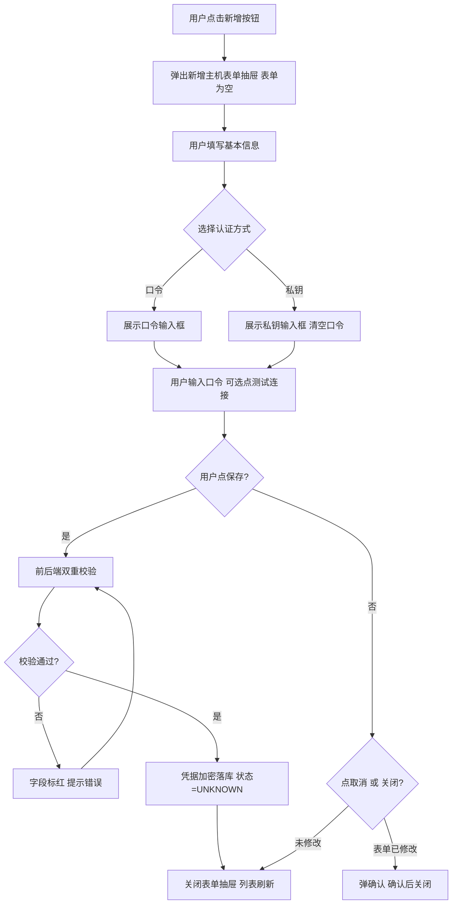
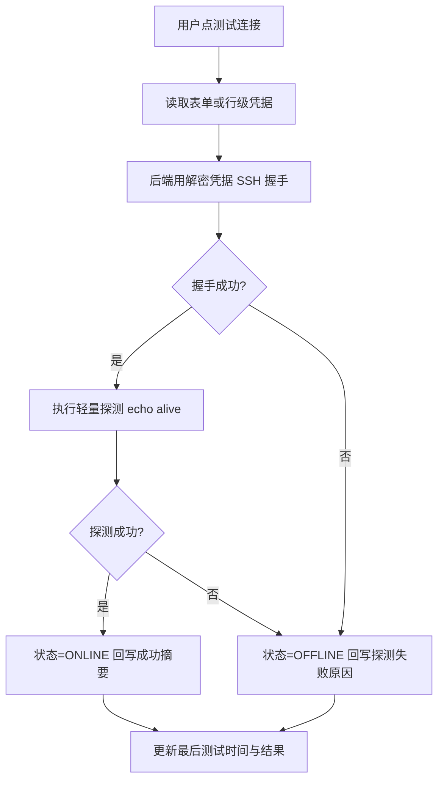
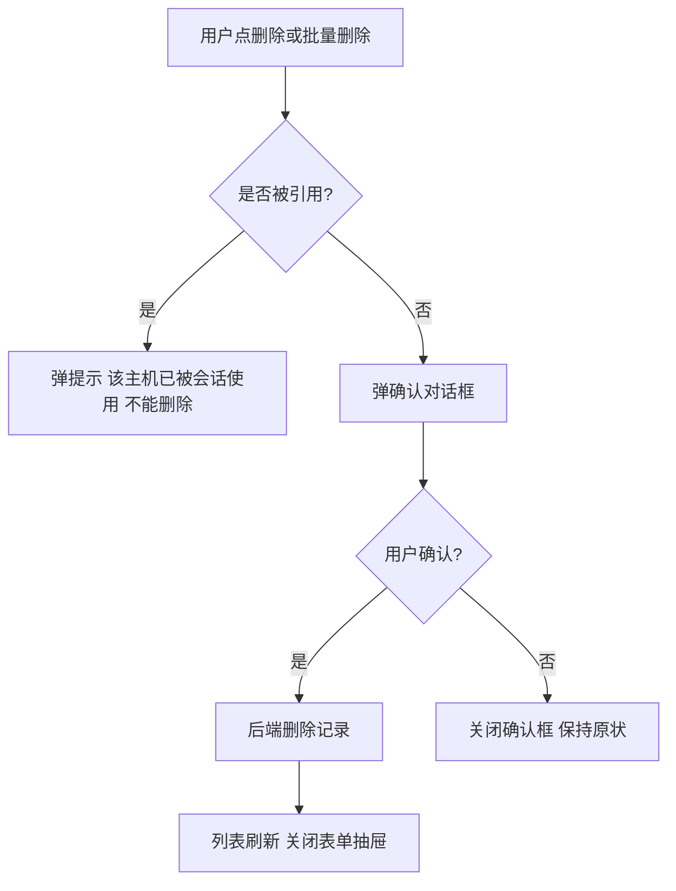

# 主机管理抽屉 需求文档

## 〇、文档信息

| 项目 | 内容 |
|------|------|
| 文档名称 | 主机管理抽屉 |
| 文档版本 | v1.0 |
| 状态 | 未确认 |
| 确认日期 | （未定稿） |
| 存放路径 | docs/current/modules/ai-assistant/PRD_主机管理抽屉.md |

## 功能概述

本抽屉用于维护"AI 助手主机运维 Tab"所使用的主机资产：支持通过 SSH 口令或 SSH 私钥两种方式接入多台 Linux/类 Unix 主机，提供列表查询、新增、编辑、删除、测试连接等能力。抽屉从 AI 助手主页右上方入口触发，跨 Tab 共享同一份主机数据。

## 角色权限

| 维度 | 要求 |
|---|---|
| 数据权限 | 运维岗仅可见本部门主机；平台管理员可见全量主机；值班员不可见本抽屉入口；普通业务用户不可见 |
| 功能权限 | 见下表 |

| 操作 | 平台管理员 | 运维岗 | 值班员 | 普通业务用户 |
|---|---|---|---|---|
| 进入主机管理抽屉 | ✓ | ✓ | - | - |
| 查询主机列表 | ✓ | ✓（本部门） | - | - |
| 新增主机 | ✓ | ✓（归属本部门） | - | - |
| 编辑主机 | ✓ | ✓（本部门主机） | - | - |
| 删除主机 | ✓ | ✓（本部门主机） | - | - |
| 测试连接 | ✓ | ✓（本部门主机） | - | - |
| 批量删除 | ✓ | ✓（本部门主机） | - | - |
| 跨部门操作 | ✓ | - | - | - |

**权限字符串清单**（用于 `@PreAuthorize("@ss.hasPermi('...')")`）：

| 权限字符串 | 含义 | 对应操作 |
|---|---|---|
| `ai:host:list` | 主机列表查询 | 抽屉列表加载、查询表单 |
| `ai:host:query` | 主机详情 | 主机行级"编辑"前置查详情 |
| `ai:host:add` | 新增主机 | 抽屉"+" 新增按钮 |
| `ai:host:edit` | 编辑主机 | 主机行级"编辑"按钮 |
| `ai:host:remove` | 删除主机 | 主机行级"删除" / 工具栏"批量删除" |
| `ai:host:test` | 测试连接 | 主机行级"测试连接" / 表单内"测试连接" |

> 抽屉入口可见性通过 `sys_menu` 隐藏菜单 + `ai:host:list` 控制；行级"编辑 / 删除 / 测试连接"按钮通过对应权限控制显隐。

## 页面结构

抽屉在 AI 助手主页右上方入口触发后从右侧滑出，宽度固定，覆盖视口右侧约 480px。主区布局：

```text
┌────────────────────────────────────────┐
│ 标题：主机管理                  [× 关闭]│
├────────────────────────────────────────┤
│ 查询区  [主机名] [IP] [状态] [查询][重置]│
├────────────────────────────────────────┤
│ 工具栏  [+ 新增] [刷新] [批量删除]      │
├────────────────────────────────────────┤
│ 列表                                    │
│ ┌────────────────────────────────────┐ │
│ │ □ 主机名 / IP / 协议 / 认证 / 状态 │ │
│ │   ...                             │ │
│ │ [编辑] [测试连接] [删除]           │ │
│ └────────────────────────────────────┘ │
├────────────────────────────────────────┤
│ 分页器                                 │
└────────────────────────────────────────┘
```

新增 / 编辑主机表单（弹层/侧滑再开一个抽屉）：

```text
┌────────────────────────────────────────┐
│ 标题：新增主机 / 编辑主机      [× 关闭]│
├────────────────────────────────────────┤
│ 基本信息                                │
│  主机名 *                               │
│  IP 地址 *                              │
│  SSH 端口 *  （默认 22）                │
│  SSH 协议 *  （默认 SSH2）              │
│  用户名 *                               │
│  所属部门 *                             │
│  备注                                   │
├────────────────────────────────────────┤
│ 认证方式 *                              │
│  ○ 口令   ○ 私钥                        │
│  ┌──────────┐   ┌──────────┐           │
│  │ 口令输入 │   │ 私钥粘贴 │           │
│  │ [******] │   │ [textarea]│          │
│  │ 测试连接 │   │ 测试连接 │           │
│  └──────────┘   └──────────┘           │
├────────────────────────────────────────┤
│ 主操作区  [取消]   [测试连接]   [保存]   │
└────────────────────────────────────────┘
```

> 抽屉与表单抽屉的打开方式：从右上方入口 → 列表抽屉；从列表的"新增/编辑"按钮 → 第二个表单抽屉（右滑叠加在第一个之上）。

## 枚举

#### 枚举：SSH 协议

| 存储值 | 展示名 | 说明 |
|---|---|---|
| SSH2 | SSH2 | 主流版本，本期仅支持 |

> 仅 SSH2 一项，列出仅为表单下拉选项的展示与取值约定。

#### 枚举：认证方式

| 存储值 | 展示名 | 说明 |
|---|---|---|
| PASSWORD | 口令 | 使用 SSH 口令登录 |
| KEY | 私钥 | 使用 SSH 私钥登录 |

#### 枚举：主机状态

| 存储值 | 展示名 | 说明 |
|---|---|---|
| ONLINE | 在线 | 最近一次"测试连接"成功 |
| OFFLINE | 离线 | 最近一次"测试连接"失败或未测过 |
| UNKNOWN | 未知 | 刚新增尚未测试 |

## 目录树

不适用。本页无左侧目录树。

## 查询功能

| 字段名 | 类型 | 是否必填 | 默认值 | 是否唯一值 | 数据来源 | 说明 |
|---|---|---|---|---|---|---|
| 主机名 | 字符串 | 否 | — | 否 | 用户输入 | 模糊匹配；去除首尾空白后参与匹配 |
| IP | 字符串 | 否 | — | 否 | 用户输入 | 模糊匹配；去除首尾空白后参与匹配 |
| 状态 | 枚举 | 否 | 全部 | 否 | 用户选择 | 取值见「主机状态」枚举；默认全部 |

**行为约定：**

- 点击「查询」按钮或按回车：按当前条件查询列表；分页重置为第 1 页。
- 点击「重置」按钮：清空主机名、IP 输入框；状态下拉恢复"全部"；查询参数恢复为空。
- 输入框内按回车：等同点击「查询」按钮。

## 列表展示

#### 列表：主机

| 字段名 | 类型 | 是否必填 | 默认值 | 是否唯一值 | 数据来源 | 说明 |
|---|---|---|---|---|---|---|
| 主机 ID | 字符串 | 是 | — | 是 | 系统生成 | 对应数据键：hostId |
| 主机名 | 字符串 | 是 | — | 是 | 用户输入 | 长度 1~64 |
| IP | 字符串 | 是 | — | 否 | 用户输入 | IPv4 / IPv6 |
| SSH 端口 | 数值 | 是 | 22 | 否 | 用户输入 | 范围 1~65535 |
| SSH 协议 | 枚举 | 是 | SSH2 | 否 | 用户输入 | 取值见「SSH 协议」枚举 |
| 用户名 | 字符串 | 是 | — | 否 | 用户输入 | 长度 1~64 |
| 认证方式 | 枚举 | 是 | — | 否 | 用户输入 | 取值见「认证方式」枚举 |
| 所属部门 | 字符串 | 是 | — | 否 | 用户选择 | 引用本系统部门字典 |
| 状态 | 枚举 | 是 | UNKNOWN | 否 | 系统写入 | 取值见「主机状态」枚举 |
| 最后测试时间 | 日期时间 | 否 | — | 否 | 系统写入 | "测试连接"成功后回写 |
| 最后测试结果 | 字符串 | 否 | — | 否 | 系统写入 | 成功 / 失败原因摘要 |
| 备注 | 字符串 | 否 | — | 否 | 用户输入 | 长度 ≤ 500 |
| 创建人 | 字符串 | 是 | — | 否 | 系统写入 | 当前登录用户 |
| 创建时间 | 日期时间 | 是 | — | 否 | 系统生成 | 毫秒级 |
| 更新时间 | 日期时间 | 是 | — | 否 | 系统生成 | 任意字段更新即刷新 |
| 更新人 | 字符串 | 是 | — | 否 | 系统写入 | 当前登录用户 |

> 列表不展示口令 / 私钥原文；表单编辑时口令字段保持为空（用户可重新输入以覆盖），私钥字段同上。

## 列表卡片

不适用。本页无卡片 / 列表切换视图。

## 工具栏按钮

| 按钮名称 | 主/次 | 显隐条件 | 打开方式/行为 | 操作结果 |
|---|---|---|---|---|
| 新增 | 主 | 用户有新增权限 | 点击"+ 新增"按钮 | 右侧叠加弹出新增主机表单抽屉；表单为空态 |
| 刷新 | 次 | 全角色可见 | 点击"刷新"按钮 | 重新查询列表（保留当前查询条件） |
| 批量删除 | 次 | 用户有删除权限且至少勾选 1 行 | 点击"批量删除"按钮 | 弹确认对话框 → 确认后逐行删除；行级"删除"按钮置灰期间不可重复点选 |
| 行级·编辑 | 次 | 用户有编辑权限 | 主机行"编辑"按钮 | 右侧叠加弹出编辑主机表单抽屉；表单回填该主机数据 |
| 行级·测试连接 | 次 | 用户有测试连接权限 | 主机行"测试连接"按钮 | 触发 SSH 连接测试；就地更新该行的"状态 / 最后测试时间 / 最后测试结果" |
| 行级·删除 | 次 | 用户有删除权限 | 主机行"删除"按钮 | 弹确认对话框 → 确认后删除该行 |
| 关闭抽屉 | 次 | 全角色可见 | 抽屉头部"×"按钮 | 关闭抽屉；回到 AI 助手主页原 Tab；不影响已发消息 |

## 表单设计

抽屉内"新增主机"/"编辑主机"表单共用同一字段表。联合唯一约束：同一所属部门下"主机名"不可重复。

#### 表单字段表

| 字段名 | 类型 | 是否必填 | 默认值 | 是否唯一值 | 数据来源 | 说明 |
|---|---|---|---|---|---|---|
| 主机名 | 字符串 | 是 | — | 是（联合唯一：所属部门+主机名） | 用户输入 | 长度 1~64；见数据验证规则 |
| IP 地址 | 字符串 | 是 | — | 否 | 用户输入 | IPv4 或 IPv6 |
| SSH 端口 | 数值 | 是 | 22 | 否 | 用户输入 | 范围 1~65535 |
| SSH 协议 | 枚举 | 是 | SSH2 | 否 | 用户选择 | 取值见「SSH 协议」枚举 |
| 用户名 | 字符串 | 是 | — | 否 | 用户输入 | 长度 1~64 |
| 所属部门 | 字符串 | 是 | — | 否 | 用户选择 | 引用本系统部门字典；新增时取当前用户部门，可改；编辑时不可改 |
| 认证方式 | 枚举 | 是 | PASSWORD | 否 | 用户单选 | 取值见「认证方式」枚举；切换时联动口令 / 私钥输入区显隐 |
| 口令 | 字符串 | 条件必填 | — | 否 | 用户输入 | 仅在认证方式 = PASSWORD 时必填；长度 1~128；密文落库 |
| 私钥 | 字符串 | 条件必填 | — | 否 | 用户输入 | 仅在认证方式 = KEY 时必填；长度 1~8192；含 BEGIN/END 标记；密文落库 |
| 备注 | 字符串 | 否 | — | 否 | 用户输入 | 长度 ≤ 500 |

**入口与分区：**

- 入口：列表抽屉工具栏的"+ 新增"或主机行的"编辑"按钮。
- 分区：基本信息（主机名 / IP / 端口 / 协议 / 用户名 / 所属部门 / 备注）+ 认证方式（口令 / 私钥切换区）。
- 主操作区按钮：取消、测试连接、保存。
- 未保存关闭确认：表单内任意字段被修改过且未保存时，关闭抽屉或点击"取消" → 弹确认对话框"表单已修改，确定放弃吗？" → 确认后关闭。

**口令 / 私钥切换：**

- 切换认证方式时，已填的"另一种"凭据输入框内容立即清空；不互通。
- 编辑既有主机时：表单口令字段留空表示"不修改"；若填入新值则覆盖原值；同理私钥字段。

## 流程图

#### 流程 1：新增主机



**编号步骤：**

1. 用户在列表抽屉点击"+ 新增"按钮。
2. 系统在列表抽屉右侧叠加弹出"新增主机"表单抽屉；表单字段全部为空。
3. 用户填写"基本信息"区（主机名、IP、端口、协议、用户名、所属部门、备注）。
4. 用户在"认证方式"切换口令 / 私钥；切换时另一侧凭据输入区立即隐藏并清空已填内容。
5. 用户填写口令或私钥；可点"测试连接"就地校验（不保存也可测）。
6. 用户点"保存"：前端先校验非空与正则；通过后提交后端。
7. 后端二次校验：必填、唯一性、字段长度、凭据加密落库。
8. 校验通过：写入数据库；状态 = UNKNOWN；关闭表单抽屉；列表刷新并按时间倒序展示。
9. 校验失败：字段标红，提示错误；不关闭表单抽屉。
10. 用户点"取消"或关闭：若表单已修改则弹确认对话框；未修改则直接关闭。

#### 流程 2：测试连接



**编号步骤：**

1. 用户点行级"测试连接"或表单内"测试连接"按钮。
2. 后端读取该主机的凭据（行级：DB 中的密文；表单：用户刚填写的明文临时缓存）。
3. 后端用解密后的凭据发起 SSH 握手（默认 10s 连接超时）。
4. 握手成功：执行轻量探测（如 `echo alive`）。
5. 探测成功：状态 = ONLINE；最后测试结果写入"成功"；最后测试时间更新。
6. 握手或探测失败：状态 = OFFLINE；最后测试结果写入失败原因摘要（如"认证失败 / 主机不可达 / 协议不匹配"）；最后测试时间更新。
7. 表单内测试不写入数据库状态（仅展示）；行级测试会更新列表状态与时间。

#### 流程 3：删除主机



**编号步骤：**

1. 用户点行级"删除"或"批量删除"按钮。
2. 后端检查该主机是否正被"AI 助手主机运维 Tab"或审计未完成记录引用：被引用则弹提示"该主机已被会话使用，不能删除"，流程结束。
3. 未被引用：弹确认对话框"确定删除主机 X 吗？删除后不可恢复"。
4. 用户确认：后端删除；列表刷新。
5. 用户取消：关闭确认框；保持原状。

## 导入导出

不适用。本期不开放主机批量导入 / 导出能力。

## 数据验证规则

### 校验范围与场景

校验触发场景为：新增、编辑主机表单提交，以及测试连接、删除操作的二次校验。后端为权威源，前端做即时反馈。

### 正则形态校验（按字段）

##### 主机名（`hostName`）

1. **适用场景**：新增、编辑。
2. **正则表达式**：

```regex
^[A-Za-z0-9_\-一-龥]{1,64}$
```

3. **错误提示**：主机名只能包含字母、数字、下划线、连字符和汉字，长度 1~64。

##### IP 地址（`ip`）

1. **适用场景**：新增、编辑。
2. **正则表达式**：

```regex
^(?:(?:25[0-5]|2[0-4]\d|1\d\d|[1-9]?\d)\.){3}(?:25[0-5]|2[0-4]\d|1\d\d|[1-9]?\d)$
```

3. **匹配说明**：IPv4。
4. **错误提示**：IP 地址格式不正确。

##### IPv6 地址（`ip`，与 IPv4 二选一）

1. **适用场景**：新增、编辑。
2. **正则表达式**：

```regex
^(?:[0-9A-Fa-f]{1,4}:){7}[0-9A-Fa-f]{1,4}$
```

3. **错误提示**：IP 地址格式不正确（IPv6）。

##### 用户名（`username`）

1. **适用场景**：新增、编辑。
2. **正则表达式**：

```regex
^[A-Za-z0-9_\-.]{1,64}$
```

3. **错误提示**：用户名只能包含字母、数字、下划线、连字符、点，长度 1~64。

##### 私钥（`privateKey`，仅认证方式 = KEY 时校验）

1. **适用场景**：新增、编辑。
2. **正则表达式**：

```regex
-----BEGIN (?:OPENSSH |RSA |EC |DSA )?PRIVATE KEY-----[\s\S]+-----END (?:OPENSSH |RSA |EC |DSA )?PRIVATE KEY-----
```

3. **错误提示**：私钥必须包含完整的 BEGIN / END 标记块。

### 其它验证规则（非正则）

1. **主机名非空**：去除首尾空白后必含非空白字符。
2. **主机名长度**：1~64 字符。
3. **主机名联合唯一**：同一所属部门下主机名不可重复；后端报错时提示"该部门下已存在同名主机"。
4. **IP 非空**：必填；需匹配 IPv4 或 IPv6 之一。
5. **SSH 端口范围**：1~65535；默认值 22。
6. **SSH 协议**：枚举下拉，仅 SSH2。
7. **用户名非空**：去除首尾空白后必含非空白字符。
8. **用户名长度**：1~64 字符。
9. **所属部门非空**：必选；引用本系统部门字典；新增时取当前用户部门，编辑时锁定。
10. **认证方式必选**：默认 PASSWORD；切换 KEY 时口令输入区隐藏并清空。
11. **口令必填（仅 PASSWORD）**：长度 1~128；密文落库；编辑留空表示不修改。
12. **私钥必填（仅 KEY）**：长度 1~8192；必须含 BEGIN / END 标记；密文落库；编辑留空表示不修改。
13. **备注长度**：≤ 500 字符。
14. **测试连接权限**：行级 / 表单内"测试连接"按钮仅在用户有测试连接权限时可见。
15. **删除前引用检查**：后端删除前检查该主机是否正被 AI 助手会话或审计未完成记录引用；被引用则拒绝删除。

### 跨字段与业务规则

1. **角色 × 数据范围联动**：运维岗新增主机时，"所属部门"取当前用户部门，可改但只能改为自己所在的部门；管理员可指定任意部门。
2. **编辑所属部门锁定**：编辑既有主机时"所属部门"字段不可修改，避免越权迁库。
3. **凭据加密落库**：口令 / 私钥入库前由后端按本系统 Jasypt 主密钥加密；列表与详情均不回显明文。
4. **删除策略**：硬删除；删除前必须通过"被引用"检查；删除后审计仍保留（事件类型 HOST_DELETE）。
5. **跨主机名称唯一性**：仅在同一所属部门下校验唯一性；不同部门下允许同名主机。
6. **审计联动**：新增 / 编辑 / 删除 / 测试连接均落入审计与日志服务（事件清单见《AI 助手 产品概要说明书》9.2 节）。

### 规则汇总（验收清单）

- [ ] AC-V01：主机名去除首尾空白后必含非空白字符；长度 1~64；同部门下唯一。
- [ ] AC-V02：IP 必填；必须匹配 IPv4 或 IPv6 正则之一。
- [ ] AC-V03：SSH 端口在 1~65535 之间；默认 22。
- [ ] AC-V04：用户名必填；长度 1~64；字符集限定。
- [ ] AC-V05：所属部门必选；新增时取当前用户部门；编辑时锁定。
- [ ] AC-V06：认证方式 = PASSWORD 时口令必填；长度 1~128；密文落库；编辑留空不修改。
- [ ] AC-V07：认证方式 = KEY 时私钥必填；含 BEGIN / END 标记；密文落库；编辑留空不修改。
- [ ] AC-V08：备注 ≤ 500 字符。
- [ ] AC-V09：运维岗仅可管理本部门主机；不可跨部门新增 / 编辑 / 删除 / 测试。
- [ ] AC-V10：删除前必须通过"被引用"检查；被引用则拒绝并提示。
- [ ] AC-V11：列表与详情不回显明文凭据；编辑时口令 / 私钥字段留空表示不修改。
- [ ] AC-V12：测试连接成功状态 = ONLINE；失败 = OFFLINE；未测过 = UNKNOWN；最后测试时间与结果实时回写。

## 注意事项

1. **凭据编辑语义**：编辑既有主机时口令 / 私钥字段为空占位，用户不输入即视为"不修改"；保存后列表与详情仍不回显明文。
2. **测试连接不落库（表单内）**：表单内点"测试连接"只展示该次结果，不写入数据库"状态 / 最后测试时间 / 最后测试结果"字段；行级"测试连接"会回写。
3. **批量删除的并发限制**：批量删除逐行串行执行；过程中任一行因"被引用"被拒绝时，已成功删除的行不回滚，弹窗提示"已删除 N 行，M 行因被引用未删除"。
4. **未保存关闭确认**：表单内任意字段被修改过且未保存时，关闭抽屉或点击"取消" → 弹确认对话框"表单已修改，确定放弃吗？"。未修改时直接关闭。
5. **主机数据范围**：值班员本抽屉入口不可见（与产品概要说明书 2.1 角色定义一致）；如需值班员使用主机，请通过运维岗代为新增。
6. **跨部门操作**：仅平台管理员可跨部门管理主机；运维岗的新增 / 编辑 / 删除 / 测试连接严格限定在自身数据范围内，越权操作由后端拒绝并返回 403。
7. **抽屉打开方式**：列表抽屉与表单抽屉均从右向左滑出；表单抽屉叠加在列表抽屉之上；同一时刻同一抽屉链路只能打开一组；关闭表单抽屉回到列表抽屉。
