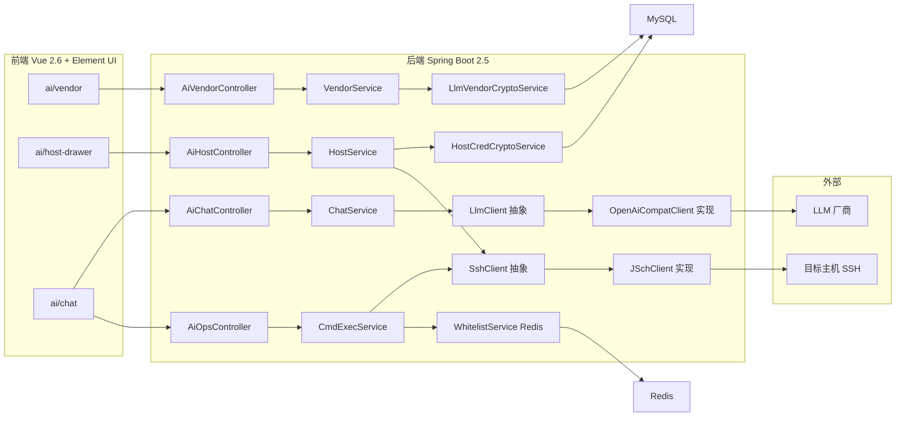
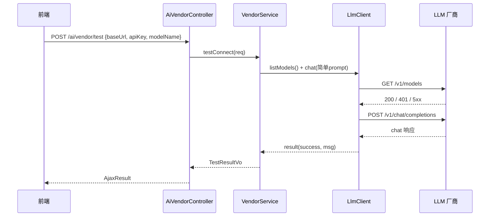
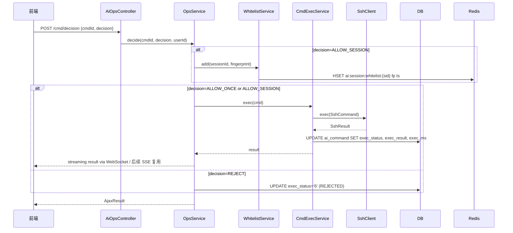

# AI 助手 详细设计

> 日期：2026-06-05 · 阶段：v1.0 设计稿 · 关联文档：`docs/current/modules/ai-assistant/PRD_AI助手*.md`

## 0. 目标

把 PRD 转成可实现的工程设计，**按顺序三阶段交付**：

| 阶段 | 模块 | 依赖 | 验收门槛 |
|---|---|---|---|
| 阶段 1 | LLM 厂商管理 | 无 | 增删改查 + 测试连通 + 设为默认，可独立运行 |
| 阶段 2 | 主机管理抽屉 | 无 | 增删改查 + 双认证（口令/私钥）+ 测试连接，可独立运行 |
| 阶段 3 | AI 助手主页 | 阶段 1 + 2 | 双 Tab + SSE 流式问答 + 命令三档审批 + 多主机并发执行 |

每一阶段都通过验收才进下一阶段。

---

## 1. 整体架构



**核心约束（沿用本项目既有约定）**：
- Java 1.8 字节码：禁用 `List.of` / `Map.of` / `var` / `record`
- Mapper 走 XML：`classpath*:mapper/**/*Mapper.xml`，无 `@Mapper` 注解
- 权限 SpEL：`@ss.hasPermi('ai:vendor:list')`
- 响应包装：`AjaxResult` / `TableDataInfo`
- 凭据加密：Jasypt 主密钥（与现有 `sys_config` 一致）
- 菜单挂载：Flyway 迁移插 `sys_menu` + `sys_role_menu`

---

## 2. 数据库表设计

**统一前缀**：`ai_`（避免与 `sys_*` / `xm_*` 冲突；标识为 myDiyManager 自定义业务）

### 2.1 阶段 1：ai_vendor

```sql
CREATE TABLE ai_vendor (
  vendor_id        BIGINT       NOT NULL                COMMENT '厂商ID',
  vendor_name      VARCHAR(64)  NOT NULL                COMMENT '厂商名称',
  base_url         VARCHAR(256) NOT NULL                COMMENT 'OpenAI 兼容 baseUrl',
  api_key_cipher   TEXT         NOT NULL                COMMENT 'apiKey 密文（Jasypt）',
  api_key_mask     VARCHAR(32)  NOT NULL                COMMENT 'apiKey 末四位摘要',
  model_name       VARCHAR(128) NOT NULL                COMMENT '模型名',
  status           CHAR(1)      DEFAULT '0'             COMMENT '状态 0启用 1停用',
  is_default       CHAR(1)      DEFAULT '0'             COMMENT '是否默认 0否 1是',
  timeout_sec      INT          DEFAULT 60              COMMENT '调用超时秒',
  max_tokens       INT          DEFAULT 2048            COMMENT '最大 token',
  temperature      DECIMAL(3,1) DEFAULT 0.7              COMMENT '温度',
  last_test_at     DATETIME     DEFAULT NULL            COMMENT '最后测试时间',
  last_test_msg    VARCHAR(500) DEFAULT NULL            COMMENT '最后测试结果',
  remark           VARCHAR(500) DEFAULT NULL            COMMENT '备注',
  create_by        VARCHAR(64)  DEFAULT ''              COMMENT '创建人',
  create_time      DATETIME     DEFAULT NULL            COMMENT '创建时间',
  update_by        VARCHAR(64)  DEFAULT ''              COMMENT '更新人',
  update_time      DATETIME     DEFAULT NULL            COMMENT '更新时间',
  PRIMARY KEY (vendor_id),
  UNIQUE KEY uk_vendor_name (vendor_name)
) ENGINE=InnoDB DEFAULT CHARSET=utf8mb4 COMMENT='AI助手-LLM厂商';
```

**唯一性约束**：通过 `uk_vendor_name` 强制；切换默认时由后端事务保证 `is_default='1'` 全表唯一。

**默认厂商初始化**：
- 系统首次启动时若无任何 `is_default='1'` 记录，AI 助手主页"厂商选择"下拉展示"未配置默认厂商"占位并禁用发送。
- 阶段 1 上线时不强求预置；阶段 3 上线前必须有 ≥1 个 `is_default='1'` 的启用厂商。

### 2.2 阶段 2：ai_host

```sql
CREATE TABLE ai_host (
  host_id          BIGINT       NOT NULL                COMMENT '主机ID',
  host_name        VARCHAR(64)  NOT NULL                COMMENT '主机名',
  ip               VARCHAR(64)  NOT NULL                COMMENT 'IP',
  ssh_port         INT          NOT NULL DEFAULT 22     COMMENT 'SSH 端口',
  ssh_protocol     VARCHAR(8)   NOT NULL DEFAULT 'SSH2' COMMENT 'SSH 协议',
  username         VARCHAR(64)  NOT NULL                COMMENT '登录用户名',
  auth_type        CHAR(1)      NOT NULL                COMMENT '认证方式 0口令 1私钥',
  password_cipher  TEXT         DEFAULT NULL            COMMENT '口令密文（auth_type=0）',
  private_key_cipher TEXT       DEFAULT NULL            COMMENT '私钥密文（auth_type=1）',
  dept_id          BIGINT       NOT NULL                COMMENT '所属部门 ID',
  status           CHAR(1)      DEFAULT '2'             COMMENT '状态 0在线 1离线 2未知',
  last_test_at     DATETIME     DEFAULT NULL            COMMENT '最后测试时间',
  last_test_msg    VARCHAR(500) DEFAULT NULL            COMMENT '最后测试结果',
  remark           VARCHAR(500) DEFAULT NULL            COMMENT '备注',
  create_by        VARCHAR(64)  DEFAULT ''              COMMENT '创建人',
  create_time      DATETIME     DEFAULT NULL            COMMENT '创建时间',
  update_by        VARCHAR(64)  DEFAULT ''              COMMENT '更新人',
  update_time      DATETIME     DEFAULT NULL            COMMENT '更新时间',
  PRIMARY KEY (host_id),
  UNIQUE KEY uk_dept_hostname (dept_id, host_name),
  KEY idx_ip (ip)
) ENGINE=InnoDB DEFAULT CHARSET=utf8mb4 COMMENT='AI助手-主机';
```

**联合唯一**：`uk_dept_hostname(dept_id, host_name)`——同部门下主机名唯一；跨部门允许同名。

**凭据落库**：`password_cipher` / `private_key_cipher` 由 Jasypt 加密；明文不在任何接口/日志中返回。

### 2.3 阶段 3：ai_session / ai_message / ai_command

```sql
CREATE TABLE ai_session (
  session_id     VARCHAR(64)  NOT NULL                COMMENT '会话ID（UUID）',
  user_id        BIGINT       NOT NULL                COMMENT '所属用户ID',
  tab_type       CHAR(1)      NOT NULL                COMMENT 'Tab类型 0智能问答 1主机运维',
  active_host_ids VARCHAR(2000) DEFAULT NULL           COMMENT '当前选中的主机ID列表（主机运维）',
  last_active_at DATETIME     NOT NULL                COMMENT '最后活跃时间（用于会话超时）',
  whitelist      TEXT         DEFAULT NULL            COMMENT '本次会话内允许的命令指纹集合（JSON）',
  create_time    DATETIME     DEFAULT NULL            COMMENT '创建时间',
  PRIMARY KEY (session_id),
  KEY idx_user (user_id)
) ENGINE=InnoDB DEFAULT CHARSET=utf8mb4 COMMENT='AI助手-会话';

CREATE TABLE ai_message (
  message_id     VARCHAR(64)  NOT NULL                COMMENT '消息ID',
  session_id     VARCHAR(64)  NOT NULL                COMMENT '所属会话ID',
  role           CHAR(1)      NOT NULL                COMMENT '角色 0用户 1AI 2系统',
  content        TEXT         NOT NULL                COMMENT '消息内容',
  vendor_id      BIGINT       DEFAULT NULL            COMMENT 'LLM 厂商ID（仅 AI 消息）',
  status         CHAR(1)      NOT NULL                COMMENT '状态 0生成中 1完成 2失败 3取消',
  first_token_ms INT          DEFAULT NULL            COMMENT '首token时延（毫秒）',
  create_time    DATETIME     NOT NULL                COMMENT '创建时间',
  PRIMARY KEY (message_id),
  KEY idx_session (session_id, create_time)
) ENGINE=InnoDB DEFAULT CHARSET=utf8mb4 COMMENT='AI助手-消息';

CREATE TABLE ai_command (
  cmd_id         VARCHAR(64)  NOT NULL                COMMENT '命令ID',
  message_id     VARCHAR(64)  NOT NULL                COMMENT '所属消息ID',
  cmd_text       TEXT         NOT NULL                COMMENT '命令原文',
  target_host_ids VARCHAR(2000) NOT NULL              COMMENT '目标主机ID列表（逗号分隔）',
  decision       CHAR(1)      NOT NULL DEFAULT '0'    COMMENT '裁决 0待裁决 1允许 2会话内允许 3拒绝',
  decision_user  VARCHAR(64)  DEFAULT NULL            COMMENT '裁决用户',
  decision_time  DATETIME     DEFAULT NULL            COMMENT '裁决时间',
  cmd_fingerprint VARCHAR(128) DEFAULT NULL           COMMENT '命令摘要指纹',
  exec_status    CHAR(1)      NOT NULL DEFAULT '0'    COMMENT '执行状态 0待执行 1执行中 2成功 3部分成功 4失败 5超时 6已拒绝',
  exec_result    TEXT         DEFAULT NULL            COMMENT '执行结果摘要',
  exec_ms        INT          DEFAULT NULL            COMMENT '执行耗时（毫秒）',
  create_time    DATETIME     NOT NULL                COMMENT '创建时间',
  PRIMARY KEY (cmd_id),
  KEY idx_message (message_id),
  KEY idx_fingerprint (cmd_fingerprint)
) ENGINE=InnoDB DEFAULT CHARSET=utf8mb4 COMMENT='AI助手-命令';
```

**会话白名单**：`whitelist` 存 JSON 数组，元素为命令指纹（`MD5(prefix + 关键动词 + 目标对象类型)`）。`WhitelistService` 用 Redis 缓存 + DB 兜底，TTL = 30 分钟（与 `last_active_at` 同步刷新）。

### 2.4 复用既有表

| 表 | 用途 |
|---|---|
| `sys_menu` | 挂 AI 助手 / LLM 厂商 / 主机抽屉 菜单 |
| `sys_role_menu` | 角色授权 |
| `sys_oper_log` | 审计（AOP 自动写） |
| `sys_config` | 高危命令关键词清单（默认值由 Flyway 迁移写入） |

---

## 3. 关键技术决策

### 3.1 LLM 客户端

| 维度 | 决策 |
|---|---|
| 选型 | **自研 `LlmClient` 接口 + `OpenAiCompatClient` 实现**（不引入第三方 SDK） |
| HTTP/SSE 工具 | **Hutool 5.8.26**（已在 `ruoyi-system` 依赖中）：`HttpRequest` 走非流式、`HttpRequest.setStreamHandler` + 自定义 `SSE 解析器` 走流式；`JSONUtil` 解析响应；`StrUtil` 处理字符串；`SecureUtil` 兜底加解密 |
| 理由 | Hutool 在本项目已统一使用；OkHttp 4.x 会与既有依赖产生版本冲突（Jasypt 传递 3.14.9）；Hutool 工具类覆盖了 HTTP/JSON/字符串/加解密等所有需求 |
| 协议 | POST `{baseUrl}/v1/chat/completions`，Header `Authorization: Bearer {apiKey}`，Body 含 `stream: true` |
| 返回 | 流式：`Consumer<ChatChunk>` 回调（按 SSE 事件增量触发）；非流式：`ChatResponse` |
| 工具类封装清单 | `cn.hutool.http.HttpRequest` / `HttpResponse`；`cn.hutool.json.JSONUtil`；`cn.hutool.core.util.StrUtil`；`cn.hutool.core.util.IdUtil`（UUID）；`cn.hutool.core.thread.ThreadUtil`（超时控制） |

### 3.2 SSH 客户端

| 维度 | 决策 |
|---|---|
| 选型 | **JSch 0.1.55** |
| 理由 | 成熟、Java 1.8 原生支持、社区方案多；Apache MINA SSHD 更现代但需要 Netty 依赖 |
| 会话 | 每次命令新开 JSch Session；命令结束立即 disconnect；不维护长连接池（避免状态泄漏） |
| 超时 | `session.connect(timeoutMs)` 与命令执行共用一个超时（默认 30s） |
| 私钥 | `JSch.addIdentity("aiHost", privateKeyBytes, null, passphraseBytes)`；passphrase 本期不暴露表单 |

### 3.3 凭据加密

| 维度 | 决策 |
|---|---|
| 库 | Jasypt（与现有 `sys_config` 加密一致） |
| 算法 | `PBEWithMD5AndDES`（沿用项目既有） |
| 主密钥 | `application.yml` 中 `jasypt.encryptor.password`（与现有同源） |
| 密文字段 | `api_key_cipher` / `password_cipher` / `private_key_cipher`（TEXT 存 BASE64） |
| 摘要字段 | `api_key_mask`（明文末四位，方便列表展示） |

### 3.4 会话白名单存储

| 维度 | 决策 |
|---|---|
| 主存 | **Redis Hash**：`ai:session:whitelist:{sessionId}` → `{fingerprint: timestamp}` |
| TTL | 30 分钟（与 `ai_session.last_active_at` 同步） |
| DB 兜底 | `ai_session.whitelist`（JSON 数组）；Redis 不可用时退化到 DB |
| 多实例 | Redis 共享，天然支持多 admin 实例部署 |
| 失效 | 关闭 Tab / 退出 / 30 分钟无活动 → 主动 DEL 该 key |

### 3.5 SSE 实现

| 维度 | 决策 |
|---|---|
| 后端→LLM 流式 | Hutool `HttpRequest` 写入 SSE body，订阅 `InputStream`，逐行解析 `data: {...}` 帧（自研 `SseLineParser` 工具类，约 50 行），每帧回调 `Consumer<ChatChunk>` |
| 后端→前端 流式 | **Spring MVC `SseEmitter`**（`org.springframework.web.servlet.mvc.method.annotation.SseEmitter`），自带 SSE 事件格式（`data:` / `event:` / `id:` / `retry:`）与生命周期回调（`onCompletion` / `onTimeout` / `onError`），比 `StreamingResponseBody` 手动拼 `data: ...\n\n` 更干净 |
| 前端 | **HTML5 `EventSource`**（标准浏览器 API） + 增量渲染；封装为 `composables/useAiSse.js`，事件回调 `onChunk` / `onDone` / `onError` / `onFirst` |
| 鉴权 | `Authorization: Bearer {jwt}` 走 `?token=` 拼接，从查询参数解析（HTML5 EventSource 不支持自定义 Header）；后端 `AiWebConfig` 注册 `OncePerRequestFilter` 仅放行 `/ai/chat/send` |
| 心跳 | SseEmitter 内置心跳：`emitter.send(SseEmitter.event().comment("keep-alive"))` 每 15s 一次，避免代理超时切断 |
| 结束 | 正常：`emitter.complete()`；异常：`emitter.completeWithError(e)`，前端 EventSource 收到 error 事件并关闭 |
| 超时 | `new SseEmitter(timeoutMs)`，默认 5 分钟（与 LLM 厂商 P95 30s 响应 + 富余 10 倍），超时触发 `onTimeout` 自动 complete |

### 3.6 多主机并发执行

| 维度 | 决策 |
|---|---|
| 线程池 | `ThreadPoolTaskExecutor`，core=10, max=20, queue=100；命名 `ai-cmd-exec-` |
| 超时 | 单台主机超时 30s（`Future.get(30, SECONDS)`） |
| 汇总 | 多台结果聚合成 `PARTIAL` / `SUCCESS` / `FAILED` |
| 隔离 | 异常 / 超时只影响该台，不影响其他主机 |

### 3.7 同类命令指纹算法

```
fingerprint = md5(cmdPrefix + ":" + verb + ":" + targetObject)

例：
  df -h /data            → md5("df :--:df:fs_usage")
  df -h /                → md5("df :--:df:fs_usage")  ← 同类
  rm -rf /tmp/cache/*    → md5("rm :--:rm:file_delete")
  rm -rf /etc/*          → md5("rm :--:rm:file_delete")  ← 同类但触发高危
```

**算法输入**：
- `cmdPrefix`：命令前两个 token（如 `df -h` → `df`）
- `verb`：标准化动词（来自白名单映射：`df` → `query_disk`, `rm` → `delete_file`, `cat` → `read_file`）
- `targetObject`：目标对象类型（`fs_usage` / `file_delete` / `read_file` / `process_kill` / `service_restart` / `other`）

**实现位置**：`com.ruoyi.system.ai.util.CmdFingerprint` 工具类 + `verbMap` 配置（Flyway 迁移写入 `sys_config`）。

---

## 4. 后端模块结构

```
ruoyi-system/src/main/java/com/ruoyi/system/ai/
├── controller/
│   ├── AiVendorController.java           (阶段1)
│   ├── AiHostController.java             (阶段2)
│   ├── AiChatController.java             (阶段3)
│   └── AiOpsController.java              (阶段3)
├── service/
│   ├── IVendorService.java / impl
│   ├── IHostService.java / impl
│   ├── IChatService.java / impl
│   ├── ICmdExecService.java / impl
│   └── IWhitelistService.java / impl
├── domain/
│   ├── AiVendor.java / Bo / Vo
│   ├── AiHost.java / Bo / Vo
│   ├── AiSession.java / Bo / Vo
│   ├── AiMessage.java / Bo / Vo
│   └── AiCommand.java / Bo / Vo
├── mapper/
│   ├── AiVendorMapper.java
│   ├── AiHostMapper.java
│   ├── AiSessionMapper.java
│   ├── AiMessageMapper.java
│   └── AiCommandMapper.java
├── llm/
│   ├── LlmClient.java                    (接口)
│   ├── ChatRequest.java / ChatResponse.java / ChatChunk.java
│   ├── OpenAiCompatClient.java
│   └── LlmException.java
├── ssh/
│   ├── SshClient.java                    (接口)
│   ├── JSchClient.java
│   ├── SshResult.java
│   └── SshException.java
├── crypto/
│   ├── LlmVendorCryptoService.java
│   └── HostCredCryptoService.java
├── config/
│   ├── AiProperties.java
│   ├── AiExecutorConfig.java
│   ├── AiWebConfig.java                  (SSE 鉴权拦截)
│   └── AiEmitterHeartbeat.java           (SseEmitter 心跳调度)
└── util/
    ├── CmdFingerprint.java
    ├── HighRiskScanner.java
    ├── SseLineParser.java                (LLM SSE 流解析)
    ├── OpsPromptTemplate.java            (主机运维系统 prompt 模板)
    └── AuditHelper.java
```

**Mapper XML 位置**：`ruoyi-system/src/main/resources/mapper/ai/*Mapper.xml`（沿用 `classpath*:mapper/**/*Mapper.xml` 扫描）

---

## 5. 阶段 1 详细设计：LLM 厂商管理

### 5.1 REST 接口

| 方法 | 路径 | 权限 | 用途 |
|---|---|---|---|
| GET | `/ai/vendor/list` | `ai:vendor:list` | 分页查询 |
| GET | `/ai/vendor/{vendorId}` | `ai:vendor:query` | 详情 |
| POST | `/ai/vendor` | `ai:vendor:add` | 新增 |
| PUT | `/ai/vendor` | `ai:vendor:edit` | 编辑 |
| DELETE | `/ai/vendor/{vendorIds}` | `ai:vendor:remove` | 删除（批量） |
| PUT | `/ai/vendor/{vendorId}/default` | `ai:vendor:default` | 设为默认 |
| POST | `/ai/vendor/test` | `ai:vendor:test` | 测试连通（不入库） |
| POST | `/ai/vendor/{vendorId}/test` | `ai:vendor:test` | 行级测试连通（回写状态） |

**请求/响应 DTO**：
- 请求：`AiVendorBo`（含 `apiKey` 明文）
- 响应：`AiVendorVo`（仅 `apiKeyMask`，不含 `apiKeyCipher`）
- 列表返回：`TableDataInfo` 包装 `List<AiVendorVo>`
- 增删改返回：`AjaxResult`

### 5.2 `LlmClient` 接口

```java
public interface LlmClient {
    /** 流式 chat */
    void chatStream(ChatRequest req, StreamHandler<ChatChunk> handler) throws LlmException;
    /** 非流式 chat（测试连通用） */
    ChatResponse chat(ChatRequest req) throws LlmException;
    /** 模型列表探测（测试连通用） */
    List<String> listModels() throws LlmException;
}
```

**实现类**：`OpenAiCompatClient`（单例 Bean；按 `vendorId` 缓存到 `ConcurrentHashMap<vendorId, LlmClient>`，apiKey 变化时失效缓存）。

### 5.3 `OpenAiCompatClient` 关键代码路径

```text
listModels()    → HttpRequest.get(baseUrl + "/v1/models")
                   .header("Authorization", "Bearer " + apiKey)
                   .execute().body() → JSONUtil.parseArray → List<String>

chat()          → HttpRequest.post(baseUrl + "/v1/chat/completions")
                   .header("Authorization", "Bearer " + apiKey)
                   .body(JSONUtil.toJsonStr(req))
                   .execute().body() → JSONUtil.parseObj → ChatResponse

chatStream()    → HttpRequest.post(...)
                   .setReadTimeout(timeoutSec * 1000)
                   .body(JSONUtil.toJsonStr(req.withStream(true)))
                   .execute() → InputStream
                   → SseLineParser 逐行解析 "data: {...}\n\n"
                   → JSONUtil.parseObj → ChatChunk
                   → Consumer<ChatChunk>.accept(chunk)
                   → 遇 "data: [DONE]" 关闭流
```

**异常分类**：
- `LlmNetworkException`（连接失败 / 超时）→ 用户提示"厂商不可达"
- `LlmAuthException`（401/403）→ 用户提示"鉴权失败"
- `LlmBizException`（4xx/5xx 非鉴权）→ 用户提示厂商侧错误码
- `LlmRateLimitException`（429）→ 提示"调用频率超限"

### 5.4 测试连通流程



**不消耗额度策略**：测试连通仅做 `listModels` + 1 次 `chat("hi", max_tokens=1)`。**需在 `application.yml` 暴露开关** `ai.vendor.test-consume-quota`（默认 `false`）；若厂商 `listModels` 鉴权失败，仍能通过 `chat` 二次验证（已加 `max_tokens=1` 兜底）。

### 5.5 设为默认的事务

```java
@Transactional(rollbackFor = Exception.class)
public void setDefault(Long vendorId) {
    vendorMapper.clearAllDefault();              // UPDATE ai_vendor SET is_default='0' WHERE is_default='1'
    vendorMapper.setDefault(vendorId);           // UPDATE ai_vendor SET is_default='1' WHERE vendor_id=?
    // 触发 WhitelistService 失效（如有缓存）
}
```

**约束校验**：
- 目标 `status='0'`，否则 `LlmVendorDisabledException`
- 目标 `is_default='1'`，则幂等返回（不报错）
- 当前默认厂商被改为 `DISABLED`，校验后置为 `is_default='0'`，事务提交后再 `clearAllDefault() + setDefault(原默认)` 是错的——本系统强制"取消默认前需指定新默认"

### 5.6 阶段 1 菜单与权限

**Flyway 迁移**：`V20260605110000__add_ai_vendor_menu.sql`

```sql
-- 顶级菜单（"系统管理"下，与 sys_config 同级）
INSERT INTO sys_menu (menu_name, parent_id, order_num, path, component, is_frame, is_cache, menu_type, visible, status, perms, icon, create_by, create_time, remark)
VALUES ('LLM 厂商', 1, 6, 'vendor', 'ai/vendor/index', 1, 0, 'C', '0', '0', 'ai:vendor:list', 'chat-dot-square', 'admin', NOW(), 'AI 助手-LLM 厂商');

-- 取上一步 LAST_INSERT_ID() 设为 @parentId
-- 子按钮：查询/新增/修改/删除/测试/默认
INSERT INTO sys_menu (menu_name, parent_id, order_num, perms, menu_type, create_by, create_time) VALUES
  ('厂商查询',   @parentId, 1, 'ai:vendor:query',  'F', 'admin', NOW()),
  ('厂商新增',   @parentId, 2, 'ai:vendor:add',    'F', 'admin', NOW()),
  ('厂商修改',   @parentId, 3, 'ai:vendor:edit',   'F', 'admin', NOW()),
  ('厂商删除',   @parentId, 4, 'ai:vendor:remove', 'F', 'admin', NOW()),
  ('厂商测试',   @parentId, 5, 'ai:vendor:test',   'F', 'admin', NOW()),
  ('设为默认',   @parentId, 6, 'ai:vendor:default','F', 'admin', NOW());

-- 授权给 admin 角色（role_id=1）与 ops_common 角色（如有）
INSERT INTO sys_role_menu (role_id, menu_id) SELECT 1, menu_id FROM sys_menu WHERE perms LIKE 'ai:vendor:%';
```

### 5.7 前端

```
ruoyi-ui/src/
├── api/ai/vendor.js
└── views/ai/vendor/index.vue
```

**`api/ai/vendor.js`**：6 个 axios 方法（list / get / add / edit / remove / setDefault / test）。
**`views/ai/vendor/index.vue`**：查询 + 工具栏 + 数据表格 + 分页 + 表单弹层；按 RuoYi 既有 `system/user/index.vue` 模板复制。

---

## 6. 阶段 2 详细设计：主机管理抽屉

### 6.1 REST 接口

| 方法 | 路径 | 权限 | 用途 |
|---|---|---|---|
| GET | `/ai/host/list` | `ai:host:list` | 分页查询（按数据范围过滤） |
| GET | `/ai/host/all` | `ai:host:list` | 全量（仅主机运维 Tab 下拉用） |
| GET | `/ai/host/{hostId}` | `ai:host:query` | 详情 |
| POST | `/ai/host` | `ai:host:add` | 新增 |
| PUT | `/ai/host` | `ai:host:edit` | 编辑 |
| DELETE | `/ai/host/{hostIds}` | `ai:host:remove` | 删除（批量） |
| POST | `/ai/host/test` | `ai:host:test` | 测试连接（不入库） |
| POST | `/ai/host/{hostId}/test` | `ai:host:test` | 行级测试（回写） |

### 6.2 `SshClient` 接口

```java
public interface SshClient {
    SshResult exec(SshCommand cmd) throws SshException;
}
```

**`SshCommand`**：`hostId`, `ip`, `port`, `username`, `authType`, `credential(CredentialProvider)`, `command`, `timeoutSec`。
**`CredentialProvider`**：函数式接口 `byte[] resolve()`——执行时调用，不在内存长期驻留。

### 6.3 `JSchClient` 实现要点

```text
1. new JSch()
2. 若 authType=KEY：jSch.addIdentity("aiHost", privateKeyBytes, null, null)
3. session = jSch.getSession(username, ip, port)
   session.setPassword(passwordBytes)  // 仅 PASSWORD
   session.setConfig("StrictHostKeyChecking", "no")
   session.connect(connectTimeoutMs)
4. ChannelExec ch = session.openChannel("exec")
   ch.setCommand(command)
   ch.setInputStream(null)
   ch.connect()
5. 异步读 stdout/stderr → 拼接
6. ch.getExitStatus() 轮询 / 带超时
7. finally: ch.disconnect() + session.disconnect() + Arrays.fill(passwordBytes, (byte)0)
```

**凭据解密时机**：`HostCredCryptoService.decrypt(cipher)` 调一次，调用结束 `Arrays.fill(buf, 0)`。

### 6.4 数据范围过滤

`HostService.list(query, userId)`：
```sql
WHERE dept_id IN (
  SELECT dept_id FROM sys_user_dept WHERE user_id = #{userId}  -- 本部门及子部门
)
```
管理员：跳过过滤；运维岗：取 `sys_user_dept`；值班员：不进入本抽屉（前端入口不渲染）。

### 6.5 删除前引用检查

```sql
SELECT COUNT(1) FROM ai_session WHERE FIND_IN_SET(#{hostId}, active_host_ids) > 0
  AND last_active_at > DATE_SUB(NOW(), INTERVAL 30 MINUTE)
```
>0 则拒绝删除，返回 `HOST_IN_USE`。

### 6.6 阶段 2 菜单与权限

抽屉入口在 AI 助手主页内，不单独挂菜单。`ai:host:list` 权限通过 sys_menu 树挂为工具栏的隐藏菜单（`visible='1'`），用于按钮级控制。

### 6.7 前端

**抽屉**：`ruoyi-ui/src/components/AiHostDrawer/index.vue`（被 AI 助手主页引用）
**视图**：`ruoyi-ui/src/views/ai/host/index.vue`（独立管理入口，本期可不做）

---

## 7. 阶段 3 详细设计：AI 助手主页

### 7.1 REST 接口

| 方法 | 路径 | 权限 | 用途 |
|---|---|---|---|
| POST | `/ai/chat/send` | `ai:chat:send` | 发送消息（SSE） |
| POST | `/ai/chat/cancel/{messageId}` | `ai:chat:cancel` | 取消生成 |
| GET | `/ai/chat/session/current` | `ai:chat:list` | 取当前会话 |
| POST | `/ai/chat/session/new` | `ai:chat:list` | 新建会话 |
| GET | `/ai/chat/sessions` | `ai:chat:list` | 历史会话列表（可选，浏览器内存为主） |
| POST | `/ai/chat/cmd/decision` | `ai:chat:cmd` | 命令裁决（allow/allowSession/reject） |

### 7.2 SSE 端点 `/ai/chat/send`

```java
@PostMapping(value = "/send", produces = MediaType.TEXT_EVENT_STREAM_VALUE)
public SseEmitter send(@RequestBody ChatSendBo bo) {
    // 1. SseEmitter 默认 30s 超时，本场景调长到 5 分钟
    SseEmitter emitter = new SseEmitter(5 * 60 * 1000L);
    long t0 = System.currentTimeMillis();
    AtomicBoolean firstChunk = new AtomicBoolean(true);

    // 2. 生命周期回调
    emitter.onCompletion(() -> log.info("[ai-chat] emitter complete, messageId={}", mid));
    emitter.onTimeout(() -> { log.warn("[ai-chat] emitter timeout"); emitter.complete(); });
    emitter.onError(e -> log.error("[ai-chat] emitter error", e));

    // 3. 异步推送（必须新线程，不能阻塞 Servlet 容器）
    chatExecutor.execute(() -> {
        try {
            String messageId = chatService.startMessage(bo);

            // 4. 订阅 LLM 流式，桥接到 SseEmitter
            chatService.streamAnswer(bo, messageId, chunk -> {
                try {
                    if (firstChunk.compareAndSet(true, false)) {
                        // 首 token 时延
                        emitter.send(SseEmitter.event()
                            .name("first")
                            .data(Map.of("elapsedMs", System.currentTimeMillis() - t0)));
                    }
                    emitter.send(SseEmitter.event()
                        .name("chunk")
                        .data(chunk, MediaType.APPLICATION_JSON));
                } catch (IOException e) {
                    emitter.completeWithError(e);
                }
            });

            // 5. 正常结束
            emitter.send(SseEmitter.event().name("done").data("[DONE]"));
            emitter.complete();

        } catch (LlmException e) {
            // 6. 异常 → 推送 error 事件后关闭
            try {
                emitter.send(SseEmitter.event()
                    .name("error")
                    .data(Map.of("code", e.getCode(), "msg", e.getMessage())));
            } catch (IOException ignored) {}
            emitter.completeWithError(e);
        }
    });

    return emitter;
}
```

**关键点**：
- SseEmitter 必须在新线程里 `send` / `complete`（不能在 Controller 线程，否则阻塞 Tomcat）
- 心跳用 `SseEmitter.event().comment("keep-alive")` 每 15s 一次（独立 ScheduledExecutor 触发，详见 `AiEmitterHeartbeat`）
- 异常路径先 `send` error 事件再 `completeWithError`，前端才能在 onerror 前拿到错误明细

**EventSource 鉴权**：浏览器 `EventSource` 不支持自定义 Header；前端在 URL 拼 `?token=<jwt>`，后端 `AiWebConfig` 注册一个 `OncePerRequestFilter` 解析 `?token=`，注入 `SecurityContext`；仅放行 `/ai/chat/send`。

### 7.3 命令裁决流程



**多主机并发**：`exec(cmd)` 内部 `tasks = hosts.map(h => execPool.submit(() -> sshExec(h)))`；`CompletableFuture.allOf` 等待 + `whenComplete` 汇总。

### 7.4 同类命令自动通过

```java
public boolean isInWhitelist(String sessionId, String fingerprint) {
    return whitelistService.contains(sessionId, fingerprint);
}

// OpsService.decide()：
if (decision == ALLOW_ONCE || isInWhitelist(sessionId, cmd.fingerprint)) {
    // 直接调度，不弹审（前端在命令卡片下不再渲染三档按钮）
    cmdExecService.exec(cmd);
}
```

**前端配合**：命令卡片渲染时若后端标记 `inWhitelist=true`，三档按钮置灰展示"+ 已会话内允许"提示。

### 7.5 系统 Prompt 模板（主机运维 Tab）

`OpsPromptTemplate.build(hosts, deptName)` 拼装的 system prompt 模板（`sys_config.config_key='ai.ops_prompt_template'` 可覆盖）：

```text
你是 myDiyManager 系统的运维助手。当前用户：{userName}，所属部门：{deptName}。
目标主机清单：
{hostList}

约束规则：
1. 回答必须分两部分：自然语言解释 + <cmd>...</cmd> 包裹的可执行命令块
2. 命令必须只读或低风险（df / free / top / ps / cat / tail / systemctl status 等）
3. 禁止破坏性命令（rm -rf /、mkfs、dd of=/dev/、iptables -F、shutdown 等）
4. 一台主机一条 <cmd> 块，跨主机时用多个 <cmd> 包裹
5. 不要输出命令执行结果预测；只输出命令
6. 不要解释命令含义
7. 高危操作必须先在自然语言部分提示"以下操作存在风险"

输出格式示例：
<cmd host="host1">df -h</cmd>
<cmd host="host2">df -h</cmd>
```

**Prompt 变量**：
- `{userName}`、`{deptName}`：来自 `LoginUser`
- `{hostList}`：`hostId=主机名(IP) 认证方式` 列表（≤200 字截断；超长时只放主机名）

### 7.6 命令结构化解析

LLM 流式输出完成后，前端正则提取 `<cmd host="...">...</cmd>` 标记；后端 `ChatService.parseCommands(rawText)` 兜底校验（防止前端被绕过或漏解析）。

**解析规则**（`OpsPromptTemplate.PARSER`）：

```js
const CMD_RE = /<cmd(?:\s+host="([^"]+)")?>([\s\S]*?)<\/cmd>/g
function parseCommands(text) {
  const cmds = []
  let m
  while ((m = CMD_RE.exec(text)) !== null) {
    cmds.push({ hostTag: m[1] || null, text: m[2].trim() })
  }
  return cmds
}
```

**后端兜底**：流式结束帧 `done` 携带 `commands` 字段（已在 `ChatService.streamAnswer` 末端解析完毕）；前端主要做渲染，后端是权威。

**目标主机映射**：
- `hostTag` 是 `hostId`（推荐）或主机名/IP（兼容）
- 后端按 `hostId` 严格匹配，匹配不到则在 AI 消息尾部追加"系统提示：主机 X 不在选择范围，已忽略该命令"

**高危命令扫描**：`HighRiskScanner.scan(cmdText)` 在解析后立即对每条命令执行，命中则在 `ai_command` 记录里加 `is_high_risk='1'`，前端命令卡片顶部红色提示。

### 7.5 高危命令扫描

`HighRiskScanner.scan(cmdText)`：
- 关键词清单存 `sys_config.config_value`（key=`ai.high_risk_keywords`）
- 命中后命令卡片顶部红色提示"高危操作，请人工复核"
- 三档按钮照常可点

**默认关键词（Flyway 初始化）**：
```
rm -rf /,chmod 777,dd of=/dev/,mkfs,shutdown,reboot,iptables -F,userdel,kill -9 1
```

### 7.7 阶段 3 菜单与权限

```sql
-- AI 助手顶级菜单
INSERT INTO sys_menu (...) VALUES ('AI 助手', 0, 5, 'chat', 'ai/chat/index', ...);
-- 智能问答 Tab 隐藏子菜单（用于按钮级权限）
INSERT INTO sys_menu (...) VALUES ('智能问答', @chatId, 1, 'ai:chat:send', 'F', ...);
-- 主机运维 Tab 隐藏子菜单
INSERT INTO sys_menu (...) VALUES ('主机运维', @chatId, 2, 'ai:chat:cmd', 'F', ...);
-- 历史会话查询
INSERT INTO sys_menu (...) VALUES ('历史会话', @chatId, 3, 'ai:chat:list', 'F', ...);
-- 抽屉入口（隐藏菜单，按钮级权限）
INSERT INTO sys_menu (...) VALUES ('主机抽屉', @chatId, 4, 'ai:host:list', 'F', ...);
```

### 7.8 前端

```
ruoyi-ui/src/
├── api/ai/chat.js
├── api/ai/ops.js
├── api/ai/host.js
├── composables/useAiSse.js              (EventSource 封装)
└── views/ai/chat/
    ├── index.vue                        (双 Tab 容器)
    ├── ChatTab.vue                      (智能问答 Tab;含 `⚙ 管理 →` 跳系统管理>LLM 厂商)
    ├── OpsTab.vue                       (主机运维 Tab)
    ├── MessageBubble.vue                (消息气泡 + markdown 渲染)
    └── CommandCard.vue                  (命令卡片 + 三档按钮)
└── components/AiHostDrawer/index.vue
```

**`composables/useAiSse.js`**（EventSource 封装）：

```js
// composables/useAiSse.js
export function useAiSse() {
  let es = null
  return {
    open({ url, token, onFirst, onChunk, onDone, onError }) {
      // EventSource 不支持自定义 Header，token 拼 URL
      es = new EventSource(`${url}?token=${encodeURIComponent(token)}`, {
        withCredentials: false,
      })
      es.addEventListener('first', e => onFirst?.(JSON.parse(e.data)))
      es.addEventListener('chunk', e => onChunk?.(JSON.parse(e.data)))
      es.addEventListener('done', () => { onDone?.(); es.close() })
      es.addEventListener('error', e => {
        // readyState === 0 是连接中，=== 2 是关闭
        onError?.(e)
        es.close()
      })
    },
    close() { es?.close(); es = null }
  }
}
```

**调用方（OpsTab.vue 关键逻辑）**：

```js
const sse = useAiSse()
async function send(content) {
  messageStore.pushUser(content)
  sse.open({
    url: '/ai/chat/send',
    token: getToken(),
    onFirst: ({ elapsedMs }) => messageStore.markFirstToken(elapsedMs),
    onChunk: chunk => messageStore.appendAiChunk(chunk),   // 增量渲染
    onDone: () => { messageStore.markDone(); parseCommands() },  // 解析命令卡片
    onError: e => messageStore.markFailed(e),
  })
}
function parseCommands() {
  // 从 AI 消息内容中提取 <cmd>...</cmd> 标记
  messageStore.extractCommands()  // 见 7.6 命令解析
}
```

**Markdown 渲染**：AI 消息体用 `markdown-it` 库解析（已加 `ruoyi-ui/package.json`），代码块用 `<pre><code>` 高亮（`highlight.js`）。**注意**：markdown-it 必须配置 `html: false` + `linkify: true` 防 XSS。

**消息清理**：组件 `beforeDestroy` 钩子调用 `sse.close()` 防止内存泄漏。

---

## 8. 错误处理与降级

| 错误 | 用户提示 | 降级 |
|---|---|---|
| LLM 厂商 5xx | "当前厂商不可用，请切换" | 顶部 banner 提示，其它 Tab 正常 |
| LLM 流式断流 | "答复中断，可重试" | 消息状态 FAILED；用户可点重试 |
| SSH 连接失败 | "主机 IP:PORT 不可达" | 该台状态 OFFLINE；不影响其他主机 |
| SSH 认证失败 | "认证失败" | 不暴露具体错因（口令错 vs 私钥错统一文案） |
| SSH 命令超时 | "命令执行超时 30s，已终止" | 强制 disconnect；不留下半截进程 |
| Redis 不可用 | 无 | `WhitelistService` 退化到 DB `ai_session.whitelist`，性能降级但功能正常 |
| Jasypt 解密失败 | "凭据无效，请重新录入" | 入参侧日志告警；前端提示 |
| 审计写失败 | 无 | `try { ... } catch { log.error }` 吞掉；不影响主链路 |

---

## 9. 审计与日志

**自动审计**：在所有 `*Controller` 上加 `@Log(title = "AI 厂商", businessType = BusinessType.INSERT/UPDATE/DELETE)`（沿用 RuoYi 既有 `@Log` 注解）。`sys_oper_log` 自动落库。

**手动审计**：自定义审计事件（命令裁决、命令执行、消息发送）通过 `AuditHelper` 显式写 `ai_audit_log` 或复用 `sys_oper_log` 的 `business_type=OTHER` + `method` 字段携带自定义信息。

**PII 脱敏**：
- LLM 原始 prompt / response 在 DEBUG 日志中按 200 字截断
- apiKey 永不进日志（`@Sensitive` 注解或手动 mask）
- 主机凭据永不进日志

---

## 10. 测试计划

### 10.1 单元测试（目标 ≥ 80% 行覆盖）

| 类 | 重点 |
|---|---|
| `LlmVendorCryptoServiceTest` | 加解密往返；明文 → 密文 → 摘要 |
| `HostCredCryptoServiceTest` | 同上 |
| `CmdFingerprintTest` | `df -h /data` 与 `df -h /` 指纹相同；`df -h` 与 `rm -rf` 不同 |
| `HighRiskScannerTest` | 关键词清单命中；空清单；大小写 |
| `VendorServiceTest` | 设为默认事务；唯一性约束；DISABLED 不可设默认 |
| `HostServiceTest` | 数据范围过滤；删除前引用检查；联合唯一 |
| `OpsServiceTest` | 三档裁决；同类命令自动通过；会话边界 |

### 10.2 集成测试（Testcontainers + 真实 LLM 可选）

| 场景 | 工具 | 是否需要真实 LLM |
|---|---|---|
| Flyway 迁移 | `flyway-core` 自动化校验 | 否 |
| LLM 厂商连通（无外部依赖） | `testcontainers` + mock SSE server（Python `aiohttp` 模拟 `/v1/chat/completions`） | 否（mock） |
| LLM 厂商连通（真实端到端） | **直接调用配置的真实厂商**（`application-test.yml` 注入 baseUrl/apiKey），用 `@Tag("llm")` 标注 | **是**（开发者本地或独立 CI Job 启用） |
| SSH 命令执行 | `testcontainers/sshd` 镜像 | 否 |
| Redis 白名单 | `testcontainers/redis:7` | 否 |

**真实 LLM 测试约定**：

1. 配置文件 `ruoyi-admin/src/test/resources/application-test.yml` 读取环境变量 `AI_TEST_VENDOR_BASE_URL` / `AI_TEST_VENDOR_API_KEY` / `AI_TEST_VENDOR_MODEL`；不配置则 `@Tag("llm")` 测试在初始化阶段 `Assumptions.assumeTrue(...)` 跳过。
2. CI 默认执行 `mvn test -Dgroups='!llm'`，排除 `llm` 标签；开发者本地或单独的 nightly Job 可 `mvn test -Dgroups='llm'` 跑全量。
3. 真实 LLM 测试用例：
   - `OpenAiCompatClientIT#chatStream_returnsValidChunks`（流式数据块结构）
   - `OpenAiCompatClientIT#chat_returnsCompleteResponse`（非流式）
   - `OpenAiCompatClientIT#listModels_returnsAtLeastOneModel`（厂商连通性回归）
4. 测试 prompt 固定为短文本（≤50 token 的 `hi` / `1+1=?`），限定 `max_tokens=16`，避免消耗厂商额度。
5. 真实 LLM 测试**不**进入覆盖率统计（Surefire 报告 `llm` 标签可独立 filter）。

### 10.3 E2E（Playwright，前台 + slowMo）

| 阶段 | 用例 |
|---|---|
| 阶段 1 | 新增厂商 → 测试连通 → 设为默认 → 列表展示 → 删除 |
| 阶段 2 | 抽屉新增口令主机 → 测试连接 → 列表展示 → 编辑 → 删除 |
| 阶段 3 | 智能问答 Tab 发问 → 流式渲染 → 主机运维 Tab 多选主机 → 三档按钮 → 命令执行 → 结果回写 → 关闭 Tab 后同类命令重审 |

### 10.4 手动验收清单

- [ ] AC-V01~V15 见《PRD_LLM厂商管理.md》12-15 节
- [ ] AC-V01~V12 见《PRD_主机管理抽屉.md》12 节
- [ ] AC-V01~V10 见《PRD_AI助手主页.md》"规则汇总"节

---

## 11. 实施顺序与时间盒

| 阶段 | 子任务 | 估算 |
|---|---|---|
| **阶段 1** | Flyway 迁移 + 实体 + Mapper + Service + Controller + 前端 CRUD + 测试连通 + 设为默认 | 5d |
| **阶段 1** | 单元测试 + 集成测试 + E2E + 文档 + 评审 | 2d |
| **阶段 2** | Flyway 迁移 + 实体 + Mapper + Service + SshClient + JSch 实现 + 前端抽屉 + 测试连接 | 5d |
| **阶段 2** | 单元测试 + 集成测试 + E2E + 文档 + 评审 | 2d |
| **阶段 3** | Flyway 迁移 + 会话/消息/命令实体 + ChatService + SSE 端点 + LLM 客户端 + WhitelistService + 指纹工具 + 前端双 Tab + 三档按钮 | 8d |
| **阶段 3** | 多主机并发 + 高危命令扫描 + 审计 + 单元测试 + 集成测试 + E2E | 4d |
| **总计** | | **26d** |

---

## 12. 风险与未决项

| 风险 | 影响 | 缓解 |
|---|---|---|
| Hutool `HttpRequest` 流式 | LLM 流式输出 | `HttpRequest.execute().bodyStream()` + 自研 `SseLineParser` 解析；如遇 Hutool 5.8.26 流式支持不完善，回退到 JDK 8 `HttpURLConnection`（无新增依赖） |
| JSch 维护状态 | SSH | JSch 0.1.55 已稳定 5+ 年；如必要可换 Apache MINA SSHD |
| EventSource 鉴权 | AI 主页 | 走 `?token=` 拼接；前端销毁后清理 URL；后端 `OncePerRequestFilter` 严格 scope 到 `/ai/chat/send` |
| 多实例部署下命令裁决时序 | 并发 | 裁决接口 `@Transactional(isolation = READ_COMMITTED)`；`exec_status` 用乐观锁 |
| 高危命令关键词维护 | 误判/漏判 | `sys_config` 动态配置；用户可自维护；不在代码层硬编码 |
| 测试厂商不消耗额度 | 测试连通 | 开关 `ai.vendor.test-consume-quota`；默认 `false`；`listModels` 优先 |
| 真实 LLM 测试的厂商依赖 | CI 不可用 | `@Tag("llm")` + `Assumptions.assumeTrue` 优雅跳过；开发者本地 / nightly job 跑 |
| 测试调用真实 LLM 的额度消耗 | 成本 | 固定短 prompt + `max_tokens=16`；CI 默认排除 `llm` 组 |

---

## 13. 不在本设计范围

- 会话跨页面/跨浏览器同步（本期浏览器内存为主）
- AI 生成 SQL 直接查询数据库
- AI 自动修复代码 / 提交 PR
- 多租户隔离（与现有 RuoYi 单租户一致）
- LLM 厂商的 token 用量计费 / 限流
- 移动端适配
- 国际化（i18n）

## 14. 前后端契约 DTO 总表

> 集中维护联调字段；具体业务规则、校验逻辑以各章节"数据验证规则"为准。

### 14.1 阶段 1：LLM 厂商

**`AiVendorBo`**（新增/编辑入参）：

| 字段 | 类型 | 必填 | 说明 |
|---|---|---|---|
| vendorId | Long | 编辑必填 | 厂商 ID |
| vendorName | String | 是 | 长度 1~64 |
| baseUrl | String | 是 | 长度 1~256；http(s) URL |
| apiKey | String | 新增必填；编辑留空不修改 | 长度 1~512 |
| modelName | String | 是 | 长度 1~128 |
| status | Char | 是 | '0' 启用 / '1' 停用 |
| isDefault | Char | 是 | '0' 否 / '1' 是 |
| timeoutSec | Integer | 是 | 5~300 |
| maxTokens | Integer | 是 | 1~32768 |
| temperature | BigDecimal | 是 | 0~2，1 位小数 |
| remark | String | 否 | ≤ 500 |

**`AiVendorVo`**（响应；不含 apiKey 明文）：

| 字段 | 类型 | 说明 |
|---|---|---|
| ...Bo 全部字段 | — | — |
| apiKeyCipher 字段 | — | **不出现在 Vo** |
| apiKeyMask | String | apiKey 末四位摘要（如 `****abcd`） |
| lastTestAt | Date | — |
| lastTestMsg | String | — |
| createBy / createTime / updateBy / updateTime | — | 审计字段 |

**`TestResultVo`**（测试连通响应）：

| 字段 | 类型 | 说明 |
|---|---|---|
| success | Boolean | 是否可达且鉴权通过 |
| message | String | 成功/失败原因 |
| modelList | List<String> | 成功时返回；前端可填回"模型名"下拉 |
| elapsedMs | Long | 探测总耗时 |

### 14.2 阶段 2：主机

**`AiHostBo`**（新增/编辑入参）：

| 字段 | 类型 | 必填 | 说明 |
|---|---|---|---|
| hostId | Long | 编辑必填 | 主机 ID |
| hostName | String | 是 | 1~64；同部门下唯一 |
| ip | String | 是 | IPv4 或 IPv6 |
| sshPort | Integer | 是 | 1~65535；默认 22 |
| sshProtocol | String | 是 | 固定 'SSH2' |
| username | String | 是 | 1~64 |
| authType | Char | 是 | '0' 口令 / '1' 私钥 |
| password | String | 条件必填 | authType='0' 时；1~128；编辑留空不修改 |
| privateKey | String | 条件必填 | authType='1' 时；含 BEGIN/END 标记；编辑留空不修改 |
| deptId | Long | 是 | 引用 sys_dept |
| remark | String | 否 | ≤ 500 |

**`AiHostVo`**（响应；不含凭证明文）：

| 字段 | 类型 | 说明 |
|---|---|---|
| ...Bo 全部字段（除 password / privateKey） | — | — |
| status | Char | '0' 在线 / '1' 离线 / '2' 未知 |
| lastTestAt / lastTestMsg / 审计字段 | — | — |

### 14.3 阶段 3：AI 助手

**`ChatSendBo`**（POST /ai/chat/send 入参）：

| 字段 | 类型 | 必填 | 说明 |
|---|---|---|---|
| tabType | Char | 是 | '0' 智能问答 / '1' 主机运维 |
| content | String | 是 | 1~4000 |
| sessionId | String | 否 | 不传则新建；传则追加到该会话 |
| vendorId | Long | 是 | 选用厂商 |
| hostIds | List<Long> | 主机运维必填 | 智能问答可为空 |

**`ChatChunk`**（SSE `chunk` 事件 data）：

| 字段 | 类型 | 说明 |
|---|---|---|
| messageId | String | 当前 AI 消息 ID |
| delta | String | 增量文本（一段或一个字） |
| finishReason | String | null=未结束 / 'stop' / 'length' / 'content_filter' |

**`ChatSendDonePayload`**（SSE `done` 事件 data，`"[DONE]"` 字符串触发）：

| 字段 | 类型 | 说明 |
|---|---|---|
| messageId | String | — |
| commands | List<CmdSummary> | 解析后的命令摘要（含 cmdId / hostIds / text / isHighRisk） |
| totalTokens | Integer | 总 token |

**`CmdDecisionBo`**（POST /ai/chat/cmd/decision 入参）：

| 字段 | 类型 | 必填 | 说明 |
|---|---|---|---|
| cmdId | String | 是 | — |
| decision | Char | 是 | '1' 允许 / '2' 会话内允许 / '3' 拒绝 |

**`CmdDecisionVo`**（响应）：

| 字段 | 类型 | 说明 |
|---|---|---|
| cmdId | String | — |
| decision | Char | — |
| inWhitelist | Boolean | 会话内允许的同类命令此值为 true |
| execStatus | Char | 允许类决策的当前执行状态 |
| execResult | String | 多主机结果按 `hostId: stdout/stderr/exitcode` 行分隔 |

### 14.4 通用响应

- 增删改：`AjaxResult`（`code` / `msg` / `data`）
- 列表分页：`TableDataInfo`（`total` / `rows` / `code` / `msg`）
- SSE 事件命名：`first` / `chunk` / `done` / `error`（`onmessage` 不复用）

### 14.5 错误码约定

| 错误码 | 含义 | 用户提示方向 |
|---|---|---|
| `AI_VENDOR_DISABLED` | 厂商已停用 | "该厂商已停用，请启用或切换其它" |
| `AI_VENDOR_DUPLICATE` | 厂商名称重复 | "已存在同名厂商" |
| `AI_VENDOR_LAST_DEFAULT` | 最后一个默认厂商 | "最后一个默认厂商不可取消" |
| `AI_HOST_IN_USE` | 主机被引用 | "该主机已被会话使用，不能删除" |
| `AI_HOST_CRED_INVALID` | 凭据错误 | "认证失败"（不暴露具体错因） |
| `AI_CMD_NOT_PENDING` | 命令非 PENDING 状态 | "该命令已裁决，无法再次操作" |
| `AI_LLM_NETWORK` | 厂商网络不可达 | "当前厂商不可用，请切换" |
| `AI_LLM_AUTH` | 厂商鉴权失败 | "鉴权失败" |
| `AI_LLM_RATE_LIMIT` | 厂商限流 | "调用频率超限" |
| `AI_SESSION_TIMEOUT` | 会话超时 | "会话已过期，请新建会话" |
